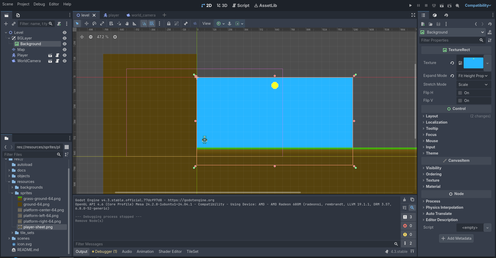
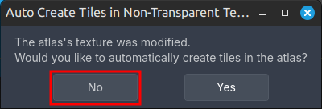
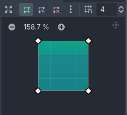
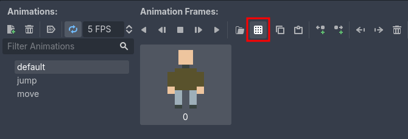
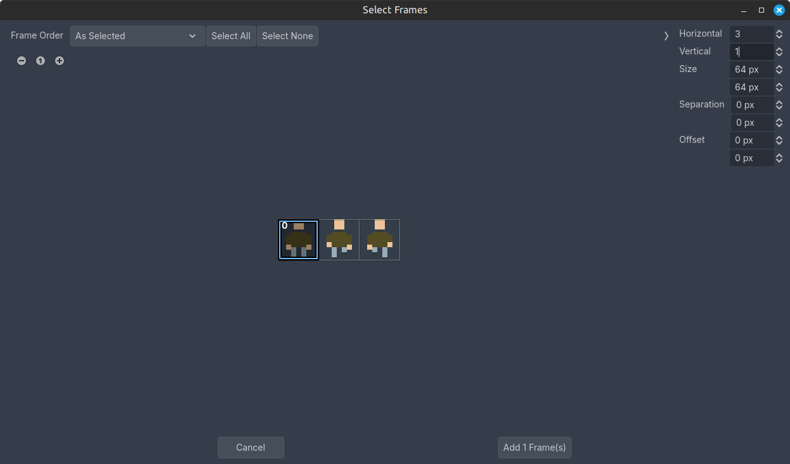
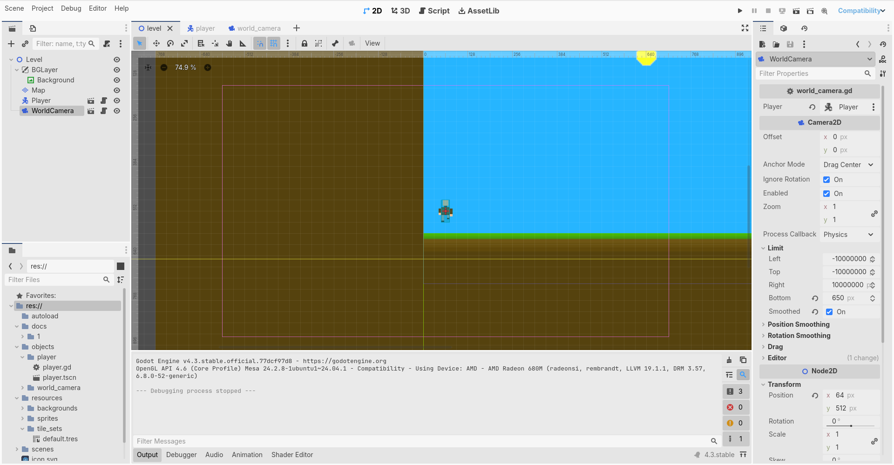

# 2D Платформер

> Часть первая

## Содержание

- [1. Настройка проекта](#1-настройка-проекта)
- [2. Создание уровня](#2-создание-уровня)
- [3. Создание карты](#3-создание-карты)
- [4. Создание игрока](#4-создание-игрока)
- [5. Создание камеры](#5-создание-камеры)

## 1. Настройка проекта

<div style="text-align: center;"></div>
<p align="center">Рисунок 1-1 – Будущий уровень</p>

Называем сам проект как душе угодно (в рамках приличия, пожалуйста) и выставляем метод рендера игры `Compatibility`.

После создания и загрузки проекта, заходим в настройки проекта через `Project` ➡️ `Project Settings`. Выставляем следующие настройки в разделе `General`:

- Вкладка `Display` ➡️ вкладка `Window`
  - Вкладка `Size`
    - `Viewport Width`: `1280`
    - `Viewport Height`: `720`
  - Вкладка `Stretch`
    - `Mode`: `canvas_items`
    - `Aspect`: `expand`
- Вкладка `Rendering` ➡️ вкладка `Textures` ➡️ вкладка `Canvas Textures`
  - `Default Texture Filter`: `Nearest`

Заходим в раздел `Input Map` и создаём новые действия для клавиш:

- Действие `jump`
  - Клавиша `W` (англ.), выбрать `Keycode (Latin Equivalent)` в `Additional Options`
- Действие `left`
  - Клавиша `D` (англ.), выбрать `Keycode (Latin Equivalent)` в `Additional Options`
- Действие `right`
  - Клавиша `A` (англ.), выбрать `Keycode (Latin Equivalent)` в `Additional Options`

Закрываем окно настроек проекта и в файловом менеджере проекта (папка проекта называется `res://`) создаём следующую структуру папок:

- `autoload` (глобальные скрипты, на будущее)
- `objects` (игровые объекты)
- `resources` (например, спрайты и изображения, которые будем использовать)
- `scenes` (различные игровые сцены)
  - `levels` (папка с уровнями, которые в будущем будут разбиты на папки с их номером)

> Студенты, обращаю внимание на то, что вместе с данным документом должна быть папка `resources`. Внутреннее содержимое можете скопировать в папку `resources` вашего проекта или можете нарисовать следующие спрайты самостоятельно:
>
> - `grass-ground-64.png` (`64x64`)
> - `ground-64.png` (`64x64`)
> - `player-sheet.png` (`192x64`; три кадра по `64x64`, первый для анимации покоя, второй и третий для анимации движения и прыжка)
> - `sky-day.png` (`1280x720`)

## 2. Создание уровня

Создаём новую 2D сцену (тип `Node2D`) и называем её `Level`. Создаём следующую структуру:

- `BGLayer` (тип `CanvasLayer`; вкладка `Layer` ➡️ `Layer`: `-100`)
  - `Background` (тип `TextureRect`; растяните узел (рис. 2-1), `Texture`: нажимаем на `<empty>` ➡️ выбираем `Quick Load...` ➡️ выбираем файл `sky-day.png`, `Expand Mode`: `Fit Height Proportional`)
- `Map` (тип `TileMapLayer`; про данный узел поговорим чуть позже)

<div style="text-align: center;"></div>
<p align="center">Рисунок 2-1 – Растягивание узла типа `Control`</p>

Сохраните сцену в папке `scenes` ➡️ `levels` ➡️ `1` с названием файла `level.tscn`

## 3. Создание карты

В нашем уровне находится объект с названием `Map` типа `TileMapLayer`. `TileMapLayer` ⎯ это узел, с помощью которого мы будем рисовать карту уровня посредством плиток (тайлов). Каждая плитка представляет собой изображение из определённой позиции в атласе ⎯ сборнике спрайтов. Тем не менее, атласом может быть и сам спрайт.

Нужно создать объект типа `TileSet` и настроить его, чтобы начинать рисовать карту уровня. Для этого нажмите на объект `Map` и в свойстве `Tile Set` нажмите на `<empty>` ➡️ `New TileSet`. Внутри созданного объекта нужно изменить свойство `Tile Size`: `(x: 64, y: 64)` и во вкладке `Physics Layers` нажать на кнопку `Add Element`.

Тем временем нужно заглянуть на нижнюю панель инструментов, где уже доступны вкладки `TileSet` и `TileMap`. Нажимаем на вкладку `TileSet` и начинаем настраивать наш объект `TileSet`. В области слева, где находится иконка `+`, будут расположены все добавленные в объект атласы. Чтобы добавить изображения `grass-ground-64.png` и `ground-64.png`, нажмите на кнопку `+` и выберите каждый в окне выбора, либо перетащите сам файл из файлового менеджера проекта в редакторе в область слева, где будут находится добавленные атласы.

Скорее всего, вы наткнётесь на данное окно, предлагающая разделить непрозрачный атлас (мы добавляли два спрайта в объект) на некоторое количество частей (рис. 3-1). Не будем этого делать и нажмём `No`.

<div style="text-align: center;"></div>
<p align="center">Рисунок 3-1 – Предложение разделить непрозрачный атлас на несколько тайлов</p>

> Если у вас каким-то образом выбирается не всё изображение а какая-либо его часть (т.е. текстура будто разделена на несколько частей), можно исправить это нажав на каждое изображение слева в панели `TileSet` и в свойствах изменить `Texture Region Size` на `(x: 64, y: 64)`

Теперь, нам нужно добавить коллизию на каждое добавленное изображение. Для этого нажимаем на каждое изображение в режиме `Setup`, переключаем режим выбора на `Paint` и указываем `Physics Layer 0` в `Paint Properties`. Затем, ниже появляется инструмент рисования коллизии тайла (рис. 3-2). В конце потребуется ещё раз нажать на тайл (изображение) в области справа. После первого рисования коллизии нет необходимости рисовать её ещё раз.

<div style="text-align: center;"></div>
<p align="center">Рисунок 3-2 – Рисование коллизии</p>

Мы настроили наш `TileSet`! В инспекторе узла `Map` нажмите на наш объект `TileSet` `ПКМ` (Правая Кнопка Мыши) и нажмите `Save As...` и сохраните его в папке `resources` ➡️ `tile_sets` и назовите файл `default.tres`.

Наконец, можно перейти на панель `TileMap` и рисовать карту уровня, выбирая "атлас" в области слева, затем ещё раз выбрав наш тайл и использовать инструменты панели (иконка карандаша, линии, прямоугольника, заливки, пипетки, ластика и т.д.).

## 4. Создание игрока

Создаём новую сцену типа `CharacterBody2D` и называем его `Player`. Создаём следующую структуру:

- `Animation` (тип `AnimatedSprite2D`; рассмотрим отдельно чуть ниже)
- `Shape` (тип `CollisionShape2D`; `Shape`: нажимаем на `<empty>` и выбираем `New RectangleShape2D` ➡️ `Size`: `(x: 24, y: 64)`)

Нам потребуется настроить анимации. Для этого нажимаем на объект `Animation`, в свойстве `Sprite Frames` нажимаем на `<empty>` и выбираем `New SpriteFrames`. В нижней части редактора появляется панель инструментов `SpriteFrames`, нажимаем на неё (рис 4-1).

<div style="text-align: center;"></div>
<p align="center">Рисунок 4-1 – Настройка анимации `SpriteFrames`</p>

Порядок действий:

- Анимация `default`
  - `FPS`: `5`
  - Добавить первый кадр из атласа `player-sheet.png` (рис. 4-2 и 4-3)
- Анимация `jump`
  - `FPS`: `2`
  - Добавить второй и третий кадр из атласа `player-sheet.png`
- Анимация `move`
  - `FPS`: `5`
  - Добавить второй и третий кадр из атласа `player-sheet.png`

<div style="text-align: center;"></div>
<p align="center">Рисунок 4-2 – Выбор кадров (часть 1)</p>

<div style="text-align: center;"></div>
<p align="center">Рисунок 4-3 – Выбор кадров (часть 2)</p>

Сохраните сцену в папке `objects` ➡️ `player` с названием файла `player.tscn`.

Создадим код для игрока:

```gdscript
class_name Player
extends CharacterBody2D

enum State { Idle, Move, Jump }

const SPEED = 300.0
const JUMP_VELOCITY = -600.0

var current_state: State = State.Idle

@onready var _animation: AnimatedSprite2D = $Animation

func _set_state(value: State) -> void:
	current_state = value
	_check_state()

func _check_state() -> void:
	match current_state:
		State.Idle:
			_animation.play("default")
		State.Move:
			_animation.play("move")
		State.Jump:
			_animation.play("jump")

func _physics_process(delta: float) -> void:
	# Гравитация
	if not is_on_floor():
		velocity += get_gravity() * delta
	
	# Прыжок
	if Input.is_action_just_pressed("jump") and is_on_floor():
		velocity.y = JUMP_VELOCITY
	
	# Движение
	var direction := Input.get_axis("left", "right")
	if direction:
		velocity.x = direction * SPEED
	else:
		velocity.x = move_toward(velocity.x, 0, SPEED)
	
    # Отражение анимации по горизонтали
	if velocity.x < 0.0:
		_animation.flip_h = true
	else:
		_animation.flip_h = false
	
	# Переключение состояний анимации
	if velocity.x != 0.0 and is_on_floor():
		_set_state(State.Move)
	elif velocity.x != 0.0 and velocity.y != 0.0 and not is_on_floor():
		_set_state(State.Jump)
	else:
		_set_state(State.Idle)
	
	move_and_slide()
```

Добавим игрока на уровень. Для этого переходим на уровень, нажимаем на объект `Level`, затем на иконку цепочки в верхней части иерархии сцен и в открывшемся окне выбираем игрока.

## 5. Создание камеры

Создаём новую сцену типа `Camera2D` и называем его `WorldCamera`. Сцена будет состоять только из данного объекта.

Изменяем следующие свойства:

- `Process Callback`: `Physics`
- Вкладка `Position Smoothing`
  - `Enabled`: `true`

Сохраните сцену в папке `objects` ➡️ `world_camera` с названием файла `world_camera.tscn`.

Добавим код для камеры:

```gdscript
class_name WorldCamera
extends Camera2D

@export var player: Player

var pin_to_player: bool = true

func _ready() -> void:
	if is_instance_valid(player):
		global_position = player.global_position

func set_pin_to_player(value: bool) -> void:
	pin_to_player = value

func _physics_process(_delta: float) -> void:
	if pin_to_player and is_instance_valid(player):
		global_position = player.global_position
```

Добавим камеру на уровень. Для этого переходим на уровень, нажимаем на объект `Level`, затем на иконку цепочки в верхней части иерархии сцен и в открывшемся окне выбираем камеру. Осталось у камеры указать игрока в свойстве `Player`.

> Возможно, вы захотите ограничить обзор камеры для нижней части, чтобы, например, не видеть нижнюю часть уровня целиком (рис. 5-1). Это можно сделать, выбрав камеру на уровне и изменить во вкладке `Limit` его свойство `Bottom`, указав необходимое значение. Через свойство `Smoothed` в этой же вкладке можно сделать остановку камеры до лимита более плавной. Чтобы увидеть лимиты камеры в редакторе, нужно включить свойство `Draw Limits` во вкладке `Editor` у камеры. После, если вы уже изменили лимит `Bottom`, например, на значение `650`, в редакторе вы увидите жёлтую линию неподалёку от игрока.

<div style="text-align: center;"></div>
<p align="center">Рисунок 5-1 – Изменение лимита обзора камеры</p>
