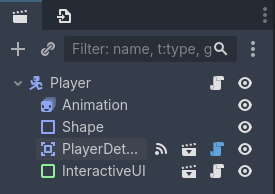

# 2D Платформер

> Часть вторая

## Содержание

- [1. Создание EventBus](#1-создание-eventbus)
- [2. Коррекция кода игрока](#2-коррекция-кода-игрока)
- [3. Создание интерактивного объекта](#3-создание-интерактивного-объекта)
- [4. Взаимодействие игрока с интерактивным объектом](#4-взаимодействие-игрока-с-интерактивным-объектом)
- [5. Создание интерфейса взаимодействия с интерактивным объектом](#5-создание-интерфейса-взаимодействия-с-интерактивным-объектом)
- [6. Создание портала](#6-создание-портала)

## 1. Создание EventBus

EventBus - это будущий глобальный скрипт, в котором будут определены глобальные события (сигналы). Данные события делаем глобальными для удобства доступа для необходимых объектов из самых разных частей игры.

Создайте скрипт с именем файла `event_bus.gd` в папке `autoload` и сделайте его общедоступным в настройках проекта. Зайдите в раздел `Globals` и рядом с полем `Path:` нажмите на иконку папки, выберете созданный скрипт в открывшемся окне выбора файла и после нажмите на кнопку `+ Add` рядом с полем `Node Name:`.

Определим следующие сигналы (листинг кода `EventBus`):

```gdscript
extends Node

# Сигналы для взаимодействия
# interactive_ui_shown - показать интерфейс взаимодействия
# interactive_ui_hide - скрыть интерфейс
# interactive_item_interacted - объект был использован
@warning_ignore("unused_signal")
signal interactive_ui_shown(item)
@warning_ignore("unused_signal")
signal interactive_ui_hide
@warning_ignore("unused_signal")
signal interactive_item_interacted(item)
```

## 2. Коррекция кода игрока

В ближайшем будущем нам понадобится находить игрока на сцене через код. Для этого нужно добавить игрока в группу `Player`. В прошлых заданиях, мы создавали группу через интерфейс редактора, теперь попробуем через код. Откройте скрипт игрока и добавьте функцию `_ready` со следующим содержимым:

```gdscript
func _ready() -> void:
	add_to_group("Player") # Добавить игрока в группу `Player`
    # Перестрахуемся, чтобы в начале игры игрок имел состояние `Idle`
	_set_state(current_state)
```

## 3. Создание интерактивного объекта

Создадим объект, с помощью которого игрок будет взаимодействовать с игровым миром - `InteractiveArea`. Создаём новую сцену типа `Area2D` и называем его `InteractiveArea`. Создаём следующую структуру внутри объекта:

- `Shape` (тип `CollisionShape2D`; `Shape` ➡️ `New RectangleShape2D`)

Сохраните сцену в папке `objects` ➡️ `interactive_area` с названием файла `interactive_area.tscn`.

Создадим код для интерактивного объекта:

```gdscript
@tool
class_name InteractiveArea
extends Area2D

enum Type { ENTITY, TRIGGER }

@export var type: Type
@export var id: String
@export var ui_name: String
@export var ui_desc: String
@export var disabled: bool
@export var delete_after: bool
@export var is_trigger_entered := true
@export var is_trigger_exited: bool

@export var size := Vector2(20, 20)

@onready var _shape: CollisionShape2D = $Shape

func _ready() -> void:
	_shape.shape = _shape.shape.duplicate()
	_change_size()

func _change_size() -> void:
	_shape.shape.size = size

func _process(_delta: float) -> void:
	if Engine.is_editor_hint():
		_change_size()

func interact() -> void:
	EventBus.interactive_item_interacted.emit(self)
	if delete_after:
		queue_free()

# Не забудьте присоединить сигнал объекта `InteractiveArea`
func _on_body_entered(body: Node2D) -> void:
	if type == Type.TRIGGER and body is Player\
	and not disabled and is_trigger_entered:
		interact()

# Не забудьте присоединить сигнал объекта `InteractiveArea`
func _on_body_exited(body: Node2D) -> void:
	if type == Type.TRIGGER and body is Player\
	and not disabled and is_trigger_exited:
		interact()
```

## 4. Взаимодействие игрока с интерактивным объектом

Создадим объект, который будет помогать игроку взаимодействовать с объектами `InteractiveArea`. Создаём новую сцену типа `Area2D` и называем его `PlayerDetectArea`. Выключим свойство `Monitorable` у объекта. Создаём следующую структуру внутри объекта:

- `Shape` (тип `CollisionShape2D`; `Shape` ➡️ `New RectangleShape2D`)

Сохраните сцену в папке `objects` ➡️ `player` ➡️ `detect_area` с названием файла `player_detect_area.tscn`.

Создадим код для `PlayerDetectArea`:

```gdscript
@tool
class_name PlayerDetectArea
extends Area2D

@export var size := Vector2(20, 20)

var _last_area: InteractiveArea

@onready var _shape: CollisionShape2D = $Shape

func _ready() -> void:
	_shape.shape = _shape.shape.duplicate()
	_change_size()

func _process(_delta: float) -> void:
	if Engine.is_editor_hint():
		_change_size()

func _change_size() -> void:
	_shape.shape.size = size

# Не забудьте присоединить сигнал объекта `PlayerDetectArea`
func _on_area_entered(area: Area2D) -> void:
	if area is InteractiveArea:
		if not area.disabled and area.type != InteractiveArea.Type.TRIGGER:
			if _last_area == null or area != _last_area:
				_last_area = area
				EventBus.interactive_ui_shown.emit(area)
			elif area == _last_area:
				EventBus.interactive_ui_shown.emit(null)
		else:
			EventBus.interactive_ui_hide.emit()
	else:
		EventBus.interactive_ui_hide.emit()

# Не забудьте присоединить сигнал объекта `PlayerDetectArea`
func _on_area_exited(area: Area2D) -> void:
	if area is InteractiveArea:
		EventBus.interactive_ui_hide.emit()
```

Добавим данный объект к игроку. Зайдём в сцену `Player` и выберем родительский элемент, затем нажмём на иконку цепочки над иерархией сцены и в открывшемся окне выберем `player_detect_area`. На рисунке 4-1 показана итоговая иерархия сцены `Player`. Также, там можно увидеть добавленный интерфейс взаимодействия с интерактивным объектом, но это мы сделаем чуть позже.

<div style="text-align: center;"></div>
<p align="center">Рисунок 4-1 – Иерархия игрока</p>

## 5. Создание интерфейса взаимодействия с интерактивным объектом

Создадим объект, который будет показывать игроку с каким объектом в игровом мире взаимодействует игрок. Создаём новую сцену типа `PanelContainer` и называем его `InteractiveUI`. Выставим у объекта предустановку якорей `Center` (рис. 5-1). Убедимся, что объект выделен в редакторе и с нажатой клавишей `Shift` поднимаем узел с помощью клавиши `⬆️` (стрелка вверх). То же самое мы могли сделать в свойстве `Position` оси `y` во вкладке `Transform` во вкладке `Layout` (вкладка `Layout` ➡️ вкладка `Transform` ➡️ свойство `Position` ось `y`). Учитываем, что верхняя оси `y` отрицательна. Для примера окончательное значение свойства `Position` было выставлено в `(x: 540, y: 240)`.

<div style="text-align: center;"></div>
<p align="center">Рисунок 5-1 – Предустановка якорей у `InteractiveUI`</p>

Создаём следующую структуру внутри объекта:

- `Margin` (тип `MarginContainer`; вкладка `Theme Overrides` ➡️ вкладка `Constants` ➡️ `Margin Left, Top, Right, Bottom`: `2`)
  - `VBox` (тип `VBoxContainer`)
    - `ItemName` (тип `Label`; сделать имя уникальным, `Text`: `Название` (необязательно), `Horizontal Alignment`: `Center`)
    - `HBox` (тип `HBoxContainer`; `Alignment`: `Center`)
      - `ItemDesc` (тип `Label`; сделать имя уникальным, `Text`: `Действие` (необязательно), `Horizontal Alignment`: `Center`)
      - `Icon` (тип `PanelContainer`; вкладка `Theme Overrides` ➡️ вкладка `Styles` ➡️ `Panel` ➡️ `New StyleBoxFlat`: вкладка `Corner Radius` ➡️ `Top Left, Right, Bottom Right, Left`: `4`, вкладка `Content Margins` ➡️ `Left, Right`: `5`)
        - `Key` (тип `Label`; `Text`: `E` (англ.), `Horizontal Alignment`: `Center`)

Сохраните сцену в папке `objects` ➡️ `interactive_ui` с названием файла `interactive_ui.tscn`.

Создадим код для `InteractiveUI`:

```gdscript
class_name InteractiveUI
extends PanelContainer

var _item: InteractiveArea

@onready var _item_name: Label = %ItemName
@onready var _item_desc: Label = %ItemDesc

func _ready() -> void:
	hide()
	_config_signals()

func _input(_event: InputEvent) -> void:
	if Input.is_action_just_pressed("interact"):
		if visible and is_instance_valid(_item):
			_item.interact()

func _config_signals() -> void:
	EventBus.interactive_ui_shown.connect(_on_interactive_ui_shown.bind())
	EventBus.interactive_ui_hide.connect(_on_interactive_ui_hide.bind())

func _on_interactive_ui_shown(new: InteractiveArea) -> void:
	if new == null:
		show()
	elif not _item == new:
		_item = new
		_item_name.text = _item.ui_name
		_item_desc.text = _item.ui_desc
	
	show()

func _on_interactive_ui_hide() -> void:
	hide()
```

Добавим данный объект к игроку также, как добавляли объект `PlayerDetectArea`.

## 6. Создание портала

Текст
