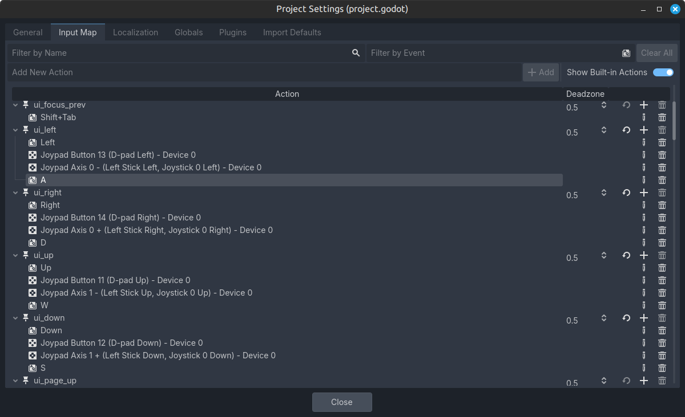
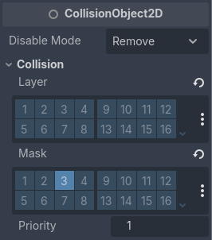
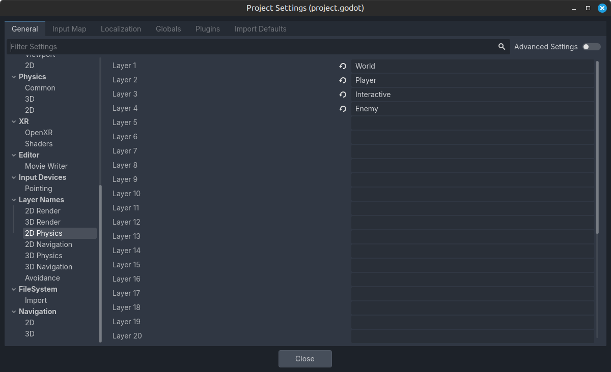
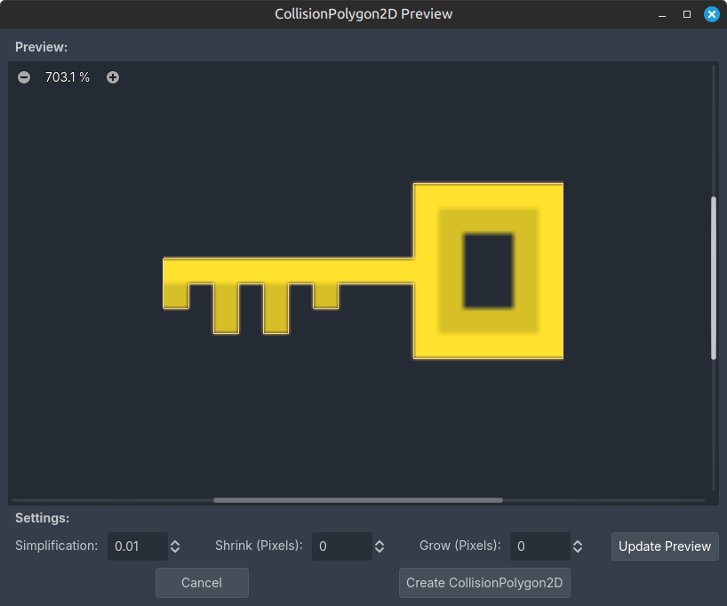
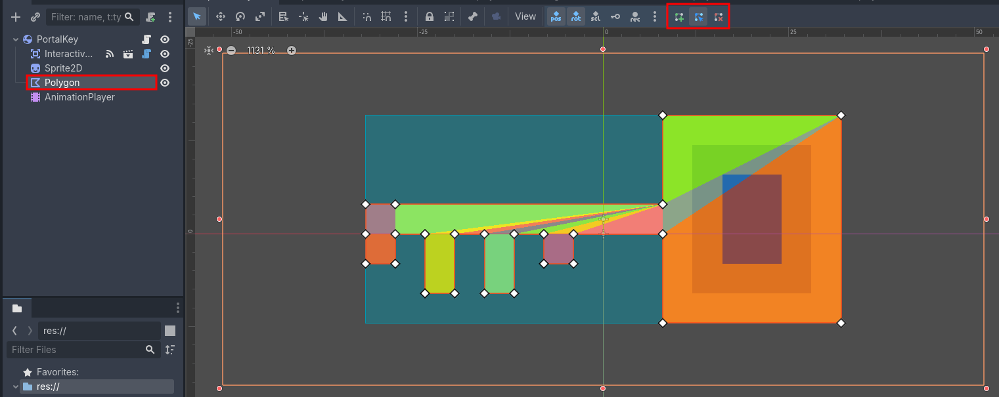
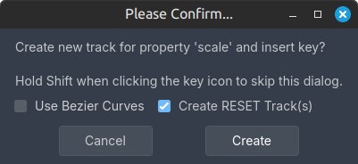
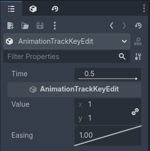
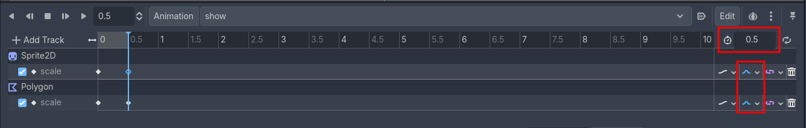

# 2D Платформер

> Часть третья

## Содержание

Текст

## Подготовка

Для начала добавим новое действие на клавишу, а также добавим к некоторым предустановленным действиям новые клавиши.

Откроем настройки проекта и в разделе `Input Map` добавим новое действие `drop` на клавишу `Q` и в дополнительных опциях клавиши выберем `Keycode (Latin Equivalent)`.

Затем, в данном разделе включим `Show Built-in Actions` (прим. перевод `Показать предустановленные действия`), найдём указанные ниже предустановленные действия и добавим определённые клавиши:

- `ui_up`
  - Добавить клавишу `W` (`Keycode (Latin Equivalent)`)
- `ui_down`
  - Добавить клавишу `S` (`Keycode (Latin Equivalent)`)
- `ui_left`
  - Добавить клавишу `A` (`Keycode (Latin Equivalent)`)
- `ui_right`
  - Добавить клавишу `D` (`Keycode (Latin Equivalent)`)

<div style="text-align: center;"></div>
<p align="center">Рисунок 1-1 – Добавление новых клавиш к предустановленным действиям</p>

## Создание ключа для портала

Создаём новую сцену типа `RigidBody2D` и называем его `PortalKey`. 

Отдельно поговорим про так называемые физические слои и маски коллизии. Раскройте у данного объекта вкладку `Collision`. Вы увидите две большие группы: слои (`Layer`) и маски (`Mask`) коллизии (рис. 2-1).

<div style="text-align: center;"></div>
<p align="center">Рисунок 2-1 – Группы слоёв коллизии</p>

Группа слоёв (`Layer`) отвечает за то, в каких слоях будет находится узел, в котором присутствует данная возможность выбора, т.е. в каких слоях находится выбранный узел. Группа масок (`Mask`) отвечает за то, какие маски будет учитывать узел, в котором присутствует данная возможность выбора, т.е. какие маски будет видеть выбранный узел.

Можно привести пример: компонент игрока, отвечающий за нахождение в мире интерактивных объектов в мире (например, монеты) не находится ни на одном слое (`Layer`), но при этом у него выбрана маска (`Mask`) `Interactive`. Это значит, что данный объект не будет видеть никто из-за отсутствия выбранных слоёв, но сам объект будет видеть только объекты, у которых будет выбран слой (`Layer`) `Interactive`.

Если ещё проще, то на слоях находятся объекты, а с помощью масок можно найти эти объекты.

По умолчанию все объекты, которые каким-либо образом образуют область соприкосновения или коллизию, находятся на слое и маске `1`.

Если вы нажмёте на три точки справа от группы слоёв или масок, откроются настройки проекта раздела `General` вкладки `Layer Names` пункта `2D Physics` (мы же делаем 2D игру, верно? 🙂)

<div style="text-align: center;"></div>
<p align="center">Рисунок 2-2 – Список 2D слоёв коллизии</p>

Определите названия для первых четырёх слоёв так же, как показано на рисунке выше и затем можете закрыть данное окно.

Вернёмся к вкладке `Collision` у нашего объекта `PortalKey`. В группе `Layer` выберем слой `3` (`Interactive`) и выключим слой `1` (`World`). Группу масок не изменяем.

<div style="text-align: center;"></div>
<p align="center">Рисунок 2-3 – Выбранные слои и маски у `PortalKey`</p>

> Ключ находится в слое с интерактивными объектами, но с помощью маски `World` может взаимодействовать с миром игры (например, лежать на земле, а не проходить через неё)
>
> Изменять слои и маски у имеющихся объектов в игре будем чуть позже.
>
> Новые спрайты будут находится рядом с текущим PDF документом в папке `resources/sprites`.

Создаём следующую структуру внутри объекта:

- `InteractiveArea` (`ID`: `portal_key`, `UI Name`: `Ключ`, `UI Desc`: `Взять`, `Delete After`: `true`, `Size`: `(x: 64, y: 28)`, `Position`: `(x: 0, y: -2)`)
- `Sprite2D` (`Texture`: выбираем спрайт ключа `key.png`, `Scale`: `(x: 0, y: 0)`)
- `Polygon` (тип `CollisionPolygon2D`; рассмотрим чуть ниже)
- `AnimationPlayer` (рассмотрим чуть ниже)

Можем создать полигональную коллизию для физического взаимодействия с миром (ключ будет падать на землю). Нажимаем на узел `Sprite2D` и в панели инструментов (рис. 2-4) нажимаем на `Sprite2D` и выбираем `Create CollisionPolygon2D`.

<div style="text-align: center;"></div>
<p align="center">Рисунок 2-3 – Выбранные слои и маски у `PortalKey`</p>

В открывшемся окне настраиваем параметры (рис. 2-4) и нажимаем кнопку `Create CollisionPolygon2D`.

<div style="text-align: center;"></div>
<p align="center">Рисунок 2-4 – Создать полигональную коллизию</p>

Если нужно будет поправить сетку полигонов, можете воспользоваться панелью инструментов (рис. 2-6). После окончательных изменений выставляем значение `(x: 0, y: 0)` у свойства `Scale` узла `Polygon`.

<div style="text-align: center;"></div>
<p align="center">Рисунок 2-6 – Панель инструментов полигональной коллизии</p>

Создаём анимацию появления объекта в мире. Создаём дочерний узел `AnimationPlayer`, если он отсутствует. Затем, нажимаем на данный узел и внизу открывается панель `Animation` (рис. 2-7).

<div style="text-align: center;"></div>
<p align="center">Рисунок 2-7 – Панель `Animation`</p>

Мы не просто так выставили значение `Scale` у спрайта и коллизии по нулям, это нужно для начала анимации появления.

В панели `Animation`, нажимаем на кнопку `Animation` и в открывшемся контекстном меню нажмём кнопку `New...`. В открывшемся окне введём название анимации `show`.

Выставим каретку в положение `0` (это значение вы можете увидеть или изменить слева от кнопки `Animation`). Во время открытой панели `Animation` заходим в узел `Sprite2D` и видим, что рядом с свойствами появились иконки ключа. Это говорит о том, что мы можем зафиксировать значение свойств в конкретное выбранное время анимации в виде ключа анимации. Находим свойство `Scale` у `Sprite2D` и нажимаем на иконку ключа. В открывшемся окне нас информируют от том, что мы собираемся зафиксировать значение выбранного свойства и предлагает создать дополнительную анимацию `RESET` для хранения начальных значений свойств (рис. 2-8). Просто нажимаем кнопку `Create`.

<div style="text-align: center;"></div>
<p align="center">Рисунок 2-8 – Фиксация нового свойства в анимации</p>

В нижней панели `Animation` изменяем значение `Snap` на `0.1`. теперь мы можем перемещать каретку на анимационной дорожке с шагом `0.1`. Перемещаем каретку на значение времени `0.5` и внутри дорожки свойства `scale` нажимаем `ПКМ` (Правая Кнопка Мыши) на каретку и выбираем кнопку `Insert Key...`. Нажимаем на созданный ключ анимации, в правой части редактора (вкладка `Inspector`) открываются настройки выбранного ключа анимации. Убедитесь, что значение времени ключа `Time` задано `0.5` и свойстве `Value` укажите значение `(x: 1, y: 1)`.

<div style="text-align: center;"></div>
<p align="center">Рисунок 2-9 – Настройка ключа анимации</p>

Теперь также зафиксируйте свойство `Scale` у узла `Polygon` в значении времени `0`, создайте новый ключ анимации в соответствующей дорожке на значении времени `0.5` и выставите свойство `Value`:`(x: 1, y: 1)`.

Сделаем последние действия с анимацией. В правой части панели `Animation` укажите время анимации (иконка секундомера) `0.5`. Теперь изменим плавность дорожек анимации на `Cubic` (рис. 2-10).

<div style="text-align: center;"></div>
<p align="center">Рисунок 2-10 – Настройка времени анимации и плавности на дорожках</p>

Сохраните сцену в папке `objects` ➡️ `portal` ➡️ `key` с названием файла `portal_key.tscn`.

Создадим код для `PortalKey`:

```gdscript
class_name PortalKey
extends RigidBody2D

@onready var _animation_player: AnimationPlayer = $AnimationPlayer
@onready var _interactive_area: InteractiveArea = $InteractiveArea

func _ready() -> void:
	_animation_player.play("show")

func get_interactive() -> InteractiveArea:
	return _interactive_area

# Присоединить сигнал `tree_exited`
# От объекта `InteractiveArea`
# К родительскому объекту (`PortalKey`)
func _on_interactive_area_tree_exited() -> void:
	queue_free()
```

Добавляем данный узел на уровень.

## Изменение слоёв и масок коллизии у объектов

- Узел `InteractiveArea`
  - В группе `Layer` выберем слой `3` (`Interactive`) и выключим слой `1` (`World`). Группу масок не изменяем.
- Узел `Player`
  - В группе `Layer` выберем слой `2` (`Player`) и выключим слой `1` (`World`). Группу масок не изменяем.
- Узел `PlayerDetectArea`
  - В группе `Layer` выключим все слои. В группе `Mask` выберем слой `3` (`Interactive`) и выключим слой `1` (`World`).

## Изменение кода у объектов

> Новые строчки кода будут помечаться комментарием `#!`, отредактированные строчки - `#?`

Код `WorldCamera`:

```gdscript
class_name WorldCamera
extends Camera2D

@export var player: Player
@export var node_2d: Node2D #!

var pin_to_player: bool = true

func _ready() -> void:
	add_to_group("WorldCamera") #!
	if is_instance_valid(player):
		global_position = player.global_position

func set_pin_to_player(value: bool) -> void:
	pin_to_player = value

func _physics_process(_delta: float) -> void:
	if pin_to_player and is_instance_valid(player):
		global_position = player.global_position
    #! Новое условие
	elif not pin_to_player and is_instance_valid(node_2d):
		global_position = node_2d.global_position
```

Код `Portal`:

```gdscript
...
...
...

func _ready() -> void:
	state = state_init
	set_state(state) #?
	EventBus.interactive_item_interacted.connect(
		_on_interactive_item_interacted.bind()
	)

func set_state(value: State) -> void: #?
	state = value
	_check_state()

...
...
...
```

Код `Player`:

```gdscript
...
...
...

var current_state: State = State.Idle
var is_busy: bool #!

@onready var _animation: AnimatedSprite2D = $Animation
@onready var _interactive_ui: InteractiveUI = $InteractiveUI #!

...
...
...

func _ready() -> void:
	add_to_group("Player")
	_set_state(current_state)

#! Новая функция
func set_busy(value: bool) -> void:
	is_busy = value

#! Новая функция
func get_interactive_ui() -> InteractiveUI:
	return _interactive_ui

...
...
...

func _physics_process(delta: float) -> void:
	# Гравитация
	if not is_on_floor():
		velocity += get_gravity() * delta
	
	if not is_busy: #!
        #? Прыжок и движение теперь в условии
		# Прыжок
		if Input.is_action_just_pressed("jump") and is_on_floor():
			velocity.y = JUMP_VELOCITY
		
		# Движение
		var direction := Input.get_axis("left", "right")
		if direction:
			velocity.x = direction * SPEED
		else:
			velocity.x = move_toward(velocity.x, 0, SPEED)
	
	...
    ...
    ...
```

Код `PlayerDetectArea`:

```gdscript
...
...
...

func _on_area_exited(area: Area2D) -> void:
	if area is InteractiveArea:
		if _last_area == area: #!
            #? Последняя строчка в условии
			EventBus.interactive_ui_hide.emit()
```

Код `InteractiveUI`:

```gdscript
class_name InteractiveUI
extends PanelContainer

var is_busy: bool #! Новая переменная

var _item: InteractiveArea

@onready var _item_name: Label = %ItemName
@onready var _item_desc: Label = %ItemDesc

func _ready() -> void:
	hide()
	_config_signals()

func _input(_event: InputEvent) -> void:
    #? Дополнение условия
	if Input.is_action_just_pressed("interact") and not is_busy:
		if visible and is_instance_valid(_item):
			_item.interact()

#! Новая функция
func set_busy(value: bool) -> void:
	is_busy = value

...
...
...
```

## Возможность открывать портал с помощью ключа

Создаём новую сцену типа `Node2D` и называем его `PortalKeyConnecter`.

Сохраните сцену в папке `objects` ➡️ `portal` ➡️ `connecter` с названием файла `portal_key_connecter.tscn`.

Создадим код для `PortalKeyConnecter`:

```gdscript
class_name PortalKeyConnecter
extends Node2D

@export var portal: Portal
@export var portal_key: PortalKey

var _portal_key_interactive_area: InteractiveArea

func _ready() -> void:
	EventBus.interactive_item_interacted.connect(
		_on_interactive_item_interacted.bind()
	)
	if portal_key:
		_portal_key_interactive_area = portal_key.get_interactive()
	else:
		printerr(
			"[%s, %s]: нет привязки к объекту класса `PortalKey`" %\
			[name, owner.scene_file_path]
		)

func _logic() -> void:
	if portal:
		portal.set_state(Portal.State.OPEN)
	else:
		printerr(
			"[%s, %s]: нет привязки к объекту класса `Portal`" %\
			[name, owner.scene_file_path]
		)

func _on_interactive_item_interacted(item: InteractiveArea) -> void:
	match item.id:
		"portal_key":
			if item == _portal_key_interactive_area:
				_logic()
```

Добавляем данный узел на уровень и указываем портал и ключ в свойствах `Portal` и `Portal Key` соответственно.

## Создание монеты

Создаём новую сцену типа `RigidBody2D` и называем его `Coin`.

- указать слои и маски
- вкладка `Solver`
- решить баг у игрока

Создаём следующую структуру внутри объекта:

- `InteractiveArea` (`ID`: `coin`, `UI Name`: `Монета`, `UI Desc`: `Взять`, `Delete After`: `true`, `Size`: `(x: 64, y: 64)`)
- `Sprite2D` (`Texture`: выбираем спрайт ключа `coin.png`, `Scale`: `(x: 0, y: 0)`)
- `Polygon` (тип `CollisionPolygon2D`; создать с помощью `Sprite2D`)
- `AnimationPlayer` (создать анимацию `show`, такую же, как у узла `PortalKey`)

Сохраните сцену в папке `objects` ➡️ `coin` с названием файла `coin.tscn`.

Создадим код для `Coin`:

```gdscript
class_name Coin
extends RigidBody2D

@onready var _animation_player: AnimationPlayer = $AnimationPlayer
@onready var _interactive_area: InteractiveArea = $InteractiveArea

func _ready() -> void:
	_animation_player.play("show")
	gravity_scale = 0.0

func get_interactive() -> InteractiveArea:
	return _interactive_area

# Присоединить сигнал `tree_exited`
# От объекта `InteractiveArea`
# К родительскому объекту (`Coin`)
func _on_interactive_area_tree_exited() -> void:
	queue_free()

# Присоединить сигнал `animation_finished`
# От объекта `AnimationPlayer`
# К родительскому объекту (`Coin`)
func _on_animation_player_animation_finished(anim_name: StringName) -> void:
	if anim_name == "show":
		gravity_scale = 1.0

# Нужно привязать сигнал `_on_body_entered` у родительского объекта `Coin`
func _on_body_entered(body: Node) -> void:
	pass
```

Добавим монету на уровень.

## Способность игрока: размещение монеты в мире

Текст
