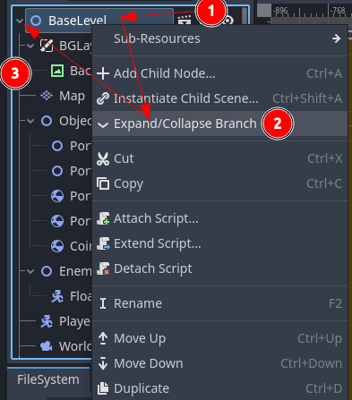
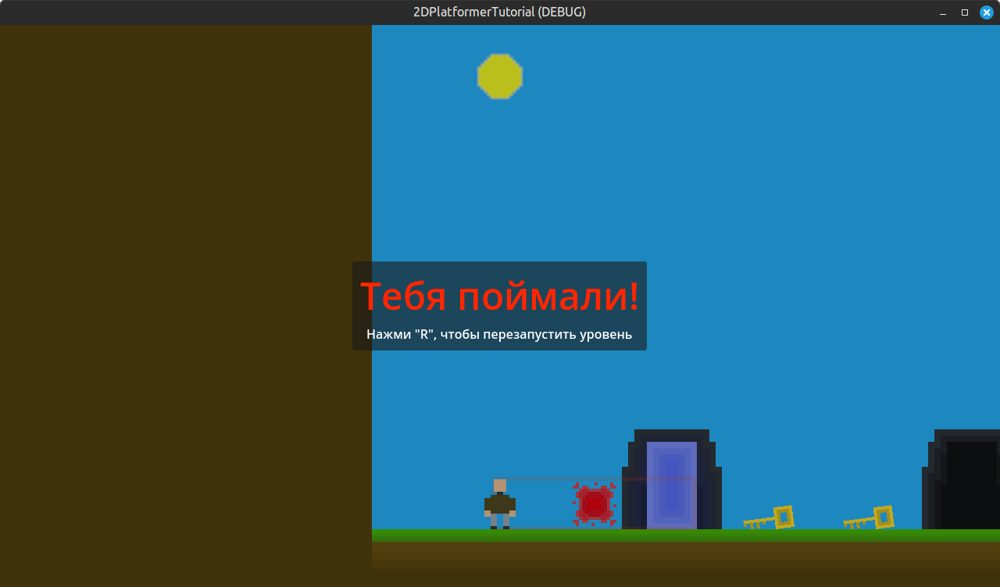

# 2D Платформер

> Часть пятая

## Содержание

- [1. Новый глобальный сигнал](#1-новый-глобальный-сигнал)
- [2. Враг ловит игрока](#2-враг-ловит-игрока)
- [3. Базовый уровень](#3-базовый-уровень)
- [4. Изменение первого уровня](#4-изменение-первого-уровня)
- [5. Интерфейс проигрыша](#5-интерфейс-проигрыша)

## 1. Новый глобальный сигнал

Добавим новый глобальный сигнал в код `EventBus`:

```gdscript
...
# Пропуск кода без изменений
...

# Игрока поймали
@warning_ignore("unused_signal")
signal get_caught
```

## 2. Враг ловит игрока

Прежде чем писать логику ловли врагом игрока, нужно сделать нужный функционал у самого игрока.

Открываем код `Player`:

> Новые строчки кода будут помечаться комментарием `#!`, отредактированные строчки - `#?`

```gdscript
...
# Пропуск кода без изменений
...

var current_state: State = State.Idle
var is_busy: bool
var is_caught: bool #! Новая переменная

@onready var _animation: AnimatedSprite2D = $Animation
@onready var _interactive_ui: InteractiveUI = $InteractiveUI
@onready var _player_coin_manager: PlayerCoinManager = $PlayerCoinManager #! Новая переменная

func _ready() -> void:
	add_to_group("Player")
	_set_state(current_state)

...
# Пропуск кода без изменений
...

func get_interactive_ui() -> InteractiveUI:
	return _interactive_ui

#! Новая функция
func get_caught() -> void:
	if not is_caught:
		is_caught = true
		_player_coin_manager._set_state(_player_coin_manager.States.OFF)
		EventBus.get_caught.emit()

func _set_state(value: State) -> void:
	current_state = value
	_check_state()

...
# Пропуск кода без изменений
...

func _physics_process(delta: float) -> void:
	# Гравитация
	if not is_on_floor():
		velocity += get_gravity() * delta
	
	# Прыжок
    #? Дополнение условия прыжка: добавлено `and not is_caught`
	if Input.is_action_just_pressed("jump") and is_on_floor() and not is_busy and not is_caught:
		velocity.y = JUMP_VELOCITY
		
	# Движение
	var direction := Input.get_axis("left", "right")
    #? Дополнение условия движения: добавлено `and not is_caught`
	if direction and not is_busy and not is_caught:
		velocity.x = direction * SPEED
	else:
		velocity.x = move_toward(velocity.x, 0, SPEED)
    
    ...
    # Пропуск кода без изменений
    ...
```

Также изменим код `PlayerCoinManager`:

```gdscript
...
# Пропуск кода без изменений
...

func _input(_event: InputEvent) -> void:
    #? Дополнение условия активации режима размещения монеты:
    #? - добавлено `and not (owner as Player).is_caught`
	if Input.is_action_just_pressed("drop") and not (owner as Player).is_caught:
		match state:
			States.OFF:
				if coins > 0:
					_set_state(States.ON)
			States.ON:
				_set_state(States.OFF)
    ...
    # Пропуск кода без изменений
    ...
```

Также изменим код `InteractiveUI`:

```gdscript
...
# Пропуск кода без изменений
...

func _input(_event: InputEvent) -> void:
    #? Дополнение условия активации режима размещения монеты:
    #? - добавлено `and not (owner as Player).is_caught`
	if Input.is_action_just_pressed("interact") and not is_busy and not (owner as Player).is_caught:
		if visible and is_instance_valid(_item):
			_item.interact()
```

Чтобы враг мог поймать игрока, нужно добавить к объекту `EnemyBase` новый дочерний объект типа `Area2D` и назвать его `CatchZone`.

В свойствах объекта `CatchZone` во вкладке `Collision` в группе `Layer` уберём слой `1` (`World`). В группе `Mask` уберём слой `1` (`World`) и добавим слой `2` (`Player`).

Затем, нужно присоединить сигнал `body_entered` от данного объекта к родительскому `EnemyBase`.

Фрагмент кода `EnemyBase`:

```gdscript
func _on_catch_zone_body_entered(body: Node2D) -> void:
    # Добавьте в функцию условие ниже
	if body is Player:
		body.get_caught()
```

<div style="text-align: center;"></div>
<p align="center">Рисунок 1-1 – Структура `EnemyBase`</p>

> Не забудьте добавить коллизию (создать дочерний `CollisionShape2D`) к `CatchZone` у объекта `FloatingEnemy`, без него враг не сможет поймать игрока.

## 3. Базовый уровень

Со временем структура каждого нового уровня начнёт повторяться и чтобы минимизировать усилия по созданию следующего нового уровня можно создать базовый уровень, который будет иметь минимальную иерархию и необходимый код.

Создадим новую сцену типа `Node2D` и назовём её `BaseLevel`. Добавим дочерний объект типа `CanvasLayer` и назовём его `FGLayer`. В будущем в качестве дочерних объектов мы будем добавлять сюда различный интерфейс, например, интерфейс окончания игры после ловли игрока врагом.

<div style="text-align: center;"></div>
<p align="center">Рисунок 2-1 – Структура `BaseLevel` (`GameOverUI` будет ниже в документе)</p>

Сохраните сцену в папке `scenes` ➡️ `base_level` с названием файла `base_level.tscn`.

Добавим скрипт к `BaseLevel`:

```gdscript
class_name BaseLevel
extends Node2D

# Уберите комментарии у строчек кода ниже,
# когда добавим объект `GameOverUI`
# @onready var game_over_ui: Control = $FGLayer/GameOverUI

func _ready() -> void:
	EventBus.get_caught.connect(_on_get_caught.bind())
	# game_over_ui.hide()

func _on_get_caught() -> void:
	print("Игрока поймали")
	# game_over_ui.show()
```

## 4. Изменение первого уровня

Сейчас будем постепенно заменять наш первый уровень его новым вариантом. Для этого создадим чистую сцену и области иерархии сцены нажмём на иконку цепочки (сочетание `Ctrl` + `Shift` + `A`) и добавим сцену базового уровня. Если имена дочерних узлов добавленного объекта стали желтыми, мы на верном пути.

Теперь зайдём на наш первый уровень, где мы всё и проверяли. Скорее всего, у вас вся сцена находится в развёрнутом виде (т.е., видны её дочерние узлы с дальнейшей иерархией) и чтобы не мучиться сейчас и не выделять каждый дочерний узел нашего уровня, мы можем свернуть всю иерархию сцены, нажав ПКм на родительский объект `Level` и выбрать действие `Expand/Collapse Branch` (прим. перевод `Раскрыть/Схлопнуть Ветку`; рис. 3-1), а затем нажать на стрелку слева от названия сцены, чтобы снова развернуть её. Теперь мы можем нажать на первый дочерний узел и, удерживая клавишу `Shift`, нажать на последний дочерний узел для выделения узлом между первым и последним. Сделайте сочетание `Ctrl` + `C` или через контекстное меню скопируйте выделенные узлы, перейдите на новую не до конца созданную сцену нового первого уровня, нажмите на родительский узел `BaseLevel` и через контекстное меню или сочетание `Ctrl` + `V` вставьте скопированные узлы на сцену.

<div style="text-align: center;"></div>
<p align="center">Рисунок 3-1 – Раскрыть/Схлопнуть иерархию сцены</p>

> Обращаю внимание на то, что связи объектов друг с другом могли разрушиться после переноса на другую сцену, поэтому исправьте это, где необходимо.

Есть два способа, как заменить старую сцену на новую:

1. **Сохранить сцену с заменой**: нажать `Ctrl` + `S`, перейти в путь к первому уровню, выбрать старую сцену для задания идентичного названия и согласиться с заменой. В этом случае, редактор может внезапно закрыться и, скорее всего, этап с заменой сцены придётся начинать с самого начала;
2. **Сохранить сцену рядом со старой**: нажать `Ctrl` + `S`, перейти в путь к первому уровню, выбрать старую сцену для задания идентичного названия и добавить какую-либо отличительную часть в название, а затем сохранить данную сцену. В таком случае остаётся удалить старую сцену и удалить отличительную часть из названия новой сцены.

## 5. Интерфейс проигрыша

Наконец, создадим экран проигрыша, который будет появляться после поимки игрока врагом. Создадим пустую сцену, добавим родительский объект типа `Control` и назовём `GameOverUI`.

Определим иерархию:

- `BG` (тип `ColorRect`; растянем данный узел, используя возможности объекта `Control` на панели инструментов (под вкладками сцен); `Color`: `00000040`)
- `Center` (тип `CenterContainer`; также растянем узел)
  - `PanelContainer`
    - `Margin` (тип `MarginContainer`; вкладка `Theme Overrides` ➡️ вкладка `Constants`: `Margin Left, Top, Right, Bottom`: `10`)
      - `VBox` (тип `VBoxContainer`)
        - `Info` (тип `Label`; `Text`: `Тебя поймали!`, `Horizontal Alignment`: `Center`, вкладка `Theme Overrides` ➡️ вкладка `Colors`: `Font Color`: `ff2600`, вкладка `Theme Overrides` ➡️ вкладка `Font Sizes`: `Font Size`: `48`)
        - `Desc` (тип `Label`; `Text`: `Нажми "R", чтобы перезапустить уровень`, `Horizontal Alignment`: `Center`)

Сохраните сцену в папке `objects` ➡️ `ui` ➡️ `game_over` с названием файла `game_over_ui.tscn`.

Добавим скрипт к `GameOverUI`:

```gdscript
class_name GameOverUI
extends Control

func _input(_event: InputEvent) -> void:
	if Input.is_action_just_pressed("restart"):
		get_tree().reload_current_scene()
```

> У нас не определено действие `restart`. Зайдите в настройки проекта и добавьте это действие с привязкой к клавише `R`.
>
> Добавьте данный объект в качестве дочернего узла к `FGLayer` у объекта `BaseLevel` через иконку цепочки.

<div style="text-align: center;"></div>
<p align="center">Рисунок 4-1 – Сцена `GameOverUI`</p>

<div style="text-align: center;"></div>
<p align="center">Рисунок 4-2 – Результат</p>