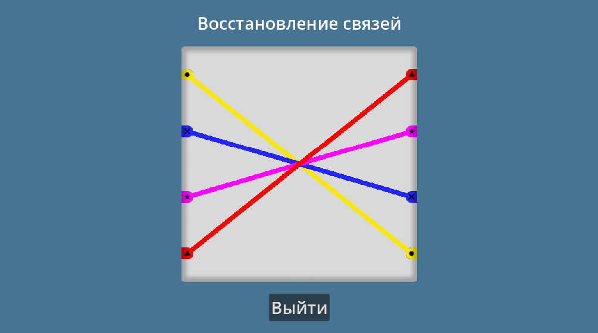
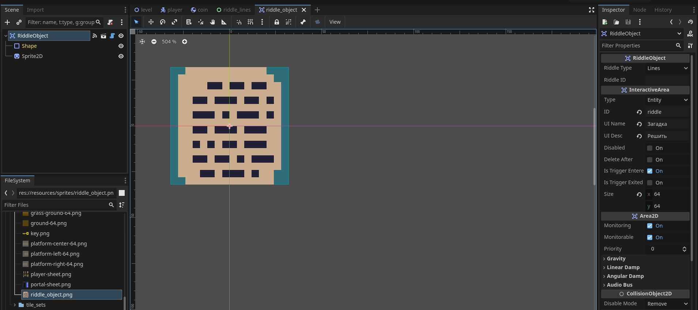

# 2D Платформер

> Часть шестая

## Содержание

- [1. Новые глобальные сигналы](#1-новые-глобальные-сигналы)
- [2. Загадка "Соединение связей": Игровой предмет](#2-загадка-соединение-связей-игровой-предмет)
- [3. Загадка "Соединение связей": Интерфейс (Часть 1)](#3-загадка-соединение-связей-интерфейс-часть-1)
- [4. Загадка "Соединение связей": Вспомогательный объект](#4-загадка-соединение-связей-вспомогательный-объект)
- [5. Загадка "Соединение связей": Интерфейс (Часть 2)](#5-загадка-соединение-связей-интерфейс-часть-2)
- [6. Изменение `PlayerCoinManager`](#6-изменение-playercoinmanager)
- [7. Изменение `Player`](#7-изменение-player)
- [8. Изменение базового уровня `BaseLevel`](#8-изменение-базового-уровня-baselevel)
- [9. Добавление скрипта на уровень](#9-добавление-скрипта-на-уровень)

## 1. Новые глобальные сигналы

Добавим новые сигналы в скрипт `EventBus`:

```gdscript
# Игрок занят [true / false]
@warning_ignore("unused_signal")
signal set_busy_player(value: bool)
# Загадка решена
@warning_ignore("unused_signal")
signal riddle_solved(riddle: RiddleObject)
```

## 2. Загадка "Соединение связей": Игровой предмет

Загадка "Соединение связей" представляет собой мини-игру, в которой нужно соединить линией идентичного цвета два противоположных по расположению окончания.

<div style="text-align: center;"></div>
<p align="center">Рисунок 2-1 – Представление мини-игры</p>

> Подготовленные спрайты будут располагаться рядом с документом в папке `resources`

Создадим пустую сцену, наследованную от типа `InteractiveArea` (создаётся через иконку цепочки) и называем `RiddleObject`. В свойствах данного объекта в типе `InteractiveArea` выставим значения свойствам `ID`: `riddle`, `UI Name`: `Загадка`, `UI Desc`: `Решить` и `Size`: `(x: 64, y: 64)`. Также добавим к родительскому узлу (`RiddleObject`) дочерний узел типа `Sprite2D` и в качестве текстуры выберем новый спрайт `res://resources/sprites/riddle_object.png`.

<div style="text-align: center;"></div>
<p align="center">Рисунок 2-2 – Результат</p>

Сохраняем сцену по пути `res://objects/riddle_object/` под именем `riddle_object.tscn`.

Теперь выделяем `RiddleObject`, нажимаем ПКМ и выбираем `ExtendScript` (Расширить Скрипт).

Код `RiddleObject`:

```gdscript
@tool
class_name RiddleObject
extends InteractiveArea

enum RiddleType { LINES, DUBLICATES, AUTO }

@export var riddle_type: RiddleType
@export var riddle_id: String

func _ready():
	super._ready()

func _process(delta):
	super._process(delta)
```

## 3. Загадка "Соединение связей": Интерфейс (Часть 1)

Создадим пустую сцену типа `Control` и назовём её `RiddleLines`. Дальнейший интерфейс мы будем создавать во второй части.

Сохраните сцену по пути `res://objects/riddles/lines/` под именем `riddle_lines.tscn`.

Добавьте новый скрипт к `RiddleLines`:

```gdscript
class_name RiddleLines
extends Control

const POINT_RED_COLOR := Color('F60504')
const POINT_BLUE_COLOR := Color('2326F5')
const POINT_YELLOW_COLOR := Color('F9E70C')
const POINT_PURPLE_COLOR := Color('FE04FD')

# const CONNECTION_POINT := preload("res://objects/riddles/lines/connection_point/connection_point.tscn")

static var left_point_red_sprite_normal := preload("res://resources/sprites/fix_connections_game/red_point_left_normal.png")
static var left_point_red_sprite_hover := preload("res://resources/sprites/fix_connections_game/red_point_left_hover.png")
static var left_point_blue_sprite_normal := preload("res://resources/sprites/fix_connections_game/blue_point_left_normal.png")
static var left_point_blue_sprite_hover := preload("res://resources/sprites/fix_connections_game/blue_point_left_hover.png")
static var left_point_yellow_sprite_normal := preload("res://resources/sprites/fix_connections_game/yellow_point_left_normal.png")
static var left_point_yellow_sprite_hover := preload("res://resources/sprites/fix_connections_game/yellow_point_left_hover.png")
static var left_point_purple_sprite_normal := preload("res://resources/sprites/fix_connections_game/purple_point_left_normal.png")
static var left_point_purple_sprite_hover := preload("res://resources/sprites/fix_connections_game/purple_point_left_hover.png")
static var right_point_red_sprite_normal := preload("res://resources/sprites/fix_connections_game/red_point_right_normal.png")
static var right_point_red_sprite_hover := preload("res://resources/sprites/fix_connections_game/red_point_right_hover.png")
static var right_point_blue_sprite_normal := preload("res://resources/sprites/fix_connections_game/blue_point_right_normal.png")
static var right_point_blue_sprite_hover := preload("res://resources/sprites/fix_connections_game/blue_point_right_hover.png")
static var right_point_yellow_sprite_normal := preload("res://resources/sprites/fix_connections_game/yellow_point_right_normal.png")
static var right_point_yellow_sprite_hover := preload("res://resources/sprites/fix_connections_game/yellow_point_right_hover.png")
static var right_point_purple_sprite_normal := preload("res://resources/sprites/fix_connections_game/purple_point_right_normal.png")
static var right_point_purple_sprite_hover := preload("res://resources/sprites/fix_connections_game/purple_point_right_hover.png")

enum PointColors { Red, Blue, Yellow, Purple }
enum PointPositions { Left, Right }

@export var mouse_point_size := 10.0
@export var riddle_object: RiddleObject

var positions_and_colors := [
	PointColors.Red,
	PointColors.Blue,
	PointColors.Yellow,
	PointColors.Purple
]

var left_point_positions := [
	Vector2(13, 60),
	Vector2(13, 180),
	Vector2(13, 320),
	Vector2(13, 440),
]

var right_point_positions := [
	Vector2(488, 60),
	Vector2(488, 180),
	Vector2(488, 320),
	Vector2(488, 440),
]

var red_line: Line2D
var blue_line: Line2D
var yellow_line: Line2D
var purple_line: Line2D

var point_entered: Node2D
var point_selected: Node2D
var over := []
var line_active: Line2D
var mouse_pressed := false
var magic_vector: Vector2 # выравнивает позицию мыши внутри SubViewport
var game_passed := false

var shape_info := CircleShape2D.new()
var shape_param := PhysicsShapeQueryParameters2D.new()
```

> Комментарий у константы `CONNECTION_POINT` мы уберём во второй части, как только создадим сам объект под названием `ConnectionPoint`.
> 
> Данный скрипт является неполным и дополнится также во второй части.
>
> Также обратите внимание на то, что в таком большом блоке кода со статическими переменными внутри функции `preload` присутствует путь до предзагружаемых спрайтов `res://resources/sprites/fix_connections_game/`. Если путь до спрайтов для мини-игры будет в другом месте, большое скопление ошибок в данном блоке подскажет вам об этом.

## 4. Загадка "Соединение связей": Вспомогательный объект

Прежде чем мы будем продолжать работать с интерфейсом мини-игры, создадим специальный вспомогательный объект для отображения окончаний на противоположных сторонах.

Создаём пустую сцену типа `StaticBody2D` и называем её `ConnectionPoint`. Добавим к нему два дочерних узла типа `Sprite2D` и `CollisionShape2D` и переименуйте узел `Sprite2D` на `Sprite` и сделайте его имя уникальным (через контекстное меню, иконка `%` у действия `Access As Unique Name`). У узла `CollisionShape2D` в свойстве `Shape` добавьте `RectangleShape2D` с размером `Size`: `(x: 15, y: 15)`.

Также, нам нужно добавить данный объект в группу `Point`.

<div style="text-align: center;"></div>
<p align="center">Рисунок 4-1 – Добавление группы `Point`</p>

Сохраните сцену по пути `res://objects/riddles/lines/connection_point/` под именем `connection_point.tscn`.

Добавьте новый скрипт к `ConnectionPoint`:

```gdscript
class_name ConnectionPoint
extends StaticBody2D

@onready var sprite: Sprite2D = %Sprite

var id_color: int
var id_position: int

var normal_texture: Texture
var hover_texture: Texture

func _ready() -> void:
	_init_image()

func _init_image() -> void:
	match id_position:
		RiddleLines.PointPositions.Left:
			match id_color:
				RiddleLines.PointColors.Red:
					normal_texture = RiddleLines.left_point_red_sprite_normal
					hover_texture = RiddleLines.left_point_red_sprite_hover
				RiddleLines.PointColors.Blue:
					normal_texture = RiddleLines.left_point_blue_sprite_normal
					hover_texture = RiddleLines.left_point_blue_sprite_hover
				RiddleLines.PointColors.Yellow:
					normal_texture = RiddleLines.left_point_yellow_sprite_normal
					hover_texture = RiddleLines.left_point_yellow_sprite_hover
				RiddleLines.PointColors.Purple:
					normal_texture = RiddleLines.left_point_purple_sprite_normal
					hover_texture = RiddleLines.left_point_purple_sprite_hover
		RiddleLines.PointPositions.Right:
			match id_color:
				RiddleLines.PointColors.Red:
					normal_texture = RiddleLines.right_point_red_sprite_normal
					hover_texture = RiddleLines.right_point_red_sprite_hover
				RiddleLines.PointColors.Blue:
					normal_texture = RiddleLines.right_point_blue_sprite_normal
					hover_texture = RiddleLines.right_point_blue_sprite_hover
				RiddleLines.PointColors.Yellow:
					normal_texture = RiddleLines.right_point_yellow_sprite_normal
					hover_texture = RiddleLines.right_point_yellow_sprite_hover
				RiddleLines.PointColors.Purple:
					normal_texture = RiddleLines.right_point_purple_sprite_normal
					hover_texture = RiddleLines.right_point_purple_sprite_hover
	sprite.texture = normal_texture

func hover() -> void:
	sprite.texture = hover_texture

func normal() -> void:
	sprite.texture = normal_texture
```

## 5. Загадка "Соединение связей": Интерфейс (Часть 2)

Продолжим работать с интерфейсом мини-игры, вернёмся на сцену `RiddleLines`. В данной части будем создавать сам интерфейс и дополнять код сцены. Структура данной сцены довольно сложна, поэтому ниже находится итоговая иерархия.

Дочерние объекты сцены `RiddleLines`:

- `BG` (тип `ColorRect`; растяните объект на весь размер сцены через панель инструментов; `Color`: `487494`)
- `Center` (тип `CenterContainer`; растяните объект на весь размер сцены через панель инструментов)
  - `MainVBox` (тип `VBoxContainer`; сделайте его имя уникальным; вкладка `Mouse` ➡️ `Filter`: `Ignore`, вкладка `Theme Overrides` ➡️ вкладка `Constants` ➡️ `Separation`: `25`)
    - `GameName` (тип `Label`; `Text`: `Восстановление связей`; `Horizontal Alignment`: `Center`, вкладка `Theme Overrides` ➡️ вкладка `Font Sizes` ➡️ `Font Size`: `36`)
    - `GameArea` (тип `TextureRect`; `Texture`: путь `res://resources/sprites/fix_connections_game/game_area.png`, вкладка `Mouse` ➡️ `Filter`: `Ignore`)
      - > Дочерние объекты узла `GameArea` будут представлены ниже
    - `ExitButton` (тип `Button`; сделайте его имя уникальным; `Text`: `Выйти`)

Дочерние объекты узла `GameArea`:

- `ViewContainer` (тип `SubViewportContainer`; растяните объект на весь размер сцены через панель инструментов; `Stretch`: `true`)
  - `SubViewport` (`Transparent BG`: `true`, `Handle Input Locally`: `false`, вкладка `Render Target` ➡️ `Update Mode`: `Always`, вкладка `Physics` ➡️ `Object Picking`: `true`)
    - `GameZone` (тип `Node2D`; сделайте его имя уникальным)
      - > Дочерние объекты узла `GameZone` будут представлены ниже
- `GameAreaShadow` (тип `TextureRect`; растяните объект на весь размер сцены через панель инструментов; `Texture`: путь `res://resources/sprites/fix_connections_game/game_area_shadow.png`, вкладка `Mouse` ➡️ `Filter`: `Ignore`)

Дочерние объекты узла `GameZone`:

- `Preview` (тип `Node2D`; сделайте его имя уникальным)
  - > Внимание, создавать дочерние узлы данного объекта не обязательно, только если вы хотите видеть, как будет выглядеть мини-игра в редакторе
  - `YellowLine` (тип `Line2D`; `Points`: `Size`: `2`, `0`: `(x: 13, y: 60)`, `1`: `(x: 488, y: 440)`; `Default Color`: `f9e70c`)
  - `BlueLine` (тип `Line2D`; `Points`: `Size`: `2`, `0`: `(x: 13, y: 180)`, `1`: `(x: 488, y: 320)`; `Default Color`: `2326f5`)
  - `PurpleLine` (тип `Line2D`; `Points`: `Size`: `2`, `0`: `(x: 13, y: 320)`, `1`: `(x: 488, y: 180)`; `Default Color`: `fe04fd`)
  - `RedLine` (тип `Line2D`; `Points`: `Size`: `2`, `0`: `(x: 13, y: 440)`, `1`: `(x: 488, y: 60)`; `Default Color`: `f60504`)
  - `YellowPointLeft` (тип `Sprite2D`; `Texture`: путь `res://resources/sprites/fix_connections_game/yellow_point_left_normal.png`, вкладка `Transform` ➡️ `Position`: `(x: 13, y: 60)`)
  - `BluePointLeft` (тип `Sprite2D`; `Texture`: путь `res://resources/sprites/fix_connections_game/blue_point_left_normal.png`, вкладка `Transform` ➡️ `Position`: `(x: 13, y: 180)`)
  - `PurplePointLeft` (тип `Sprite2D`; `Texture`: путь `res://resources/sprites/fix_connections_game/purple_point_left_normal.png`, вкладка `Transform` ➡️ `Position`: `(x: 13, y: 320)`)
  - `RedPointLeft` (тип `Sprite2D`; `Texture`: путь `res://resources/sprites/fix_connections_game/red_point_left_normal.png`, вкладка `Transform` ➡️ `Position`: `(x: 13, y: 440)`)
  - `YellowPointRight` (тип `Sprite2D`; `Texture`: путь `res://resources/sprites/fix_connections_game/yellow_point_right_normal.png`, вкладка `Transform` ➡️ `Position`: `(x: 488, y: 440)`)
  - `BluePointRight` (тип `Sprite2D`; `Texture`: путь `res://resources/sprites/fix_connections_game/blue_point_right_normal.png`, вкладка `Transform` ➡️ `Position`: `(x: 488, y: 320)`)
  - `PurplePointRight` (тип `Sprite2D`; `Texture`: путь `res://resources/sprites/fix_connections_game/purple_point_right_normal.png`, вкладка `Transform` ➡️ `Position`: `(x: 488, y: 180)`)
  - `RedPointRight` (тип `Sprite2D`; `Texture`: путь `res://resources/sprites/fix_connections_game/red_point_right_normal.png`, вкладка `Transform` ➡️ `Position`: `(x: 488, y: 60)`)
- `Lines` (тип `Node2D`; сделайте его имя уникальным)
- `Points` (тип `Node2D`; сделайте его имя уникальным)

<div style="text-align: center;"></div>
<p align="center">Рисунок 5-1 – Иерархия `RiddleLines`</p>

Дополним скрипт `RiddleLines`:

> Уберите комментарий у константы `CONNECTION_POINT`

```gdscript
### Код в начале без изменений
...
### Код в начале без изменений

@onready var main_v_box: VBoxContainer = %MainVBox
@onready var sub_viewport: SubViewport = %SubViewport
@onready var game_zone: Node2D = %GameZone
@onready var preview: Node2D = %Preview
@onready var lines: Node2D = %Lines
@onready var points: Node2D = %Points
@onready var exit_button: Button = %ExitButton

func _ready() -> void:
	randomize()
	preview.queue_free()
	shape_info.radius = mouse_point_size
	shape_param.shape_rid = shape_info.get_rid()
	Input.mouse_mode = Input.MOUSE_MODE_VISIBLE
	_generate_points()

func _generate_points() -> void:
	var left_positions := positions_and_colors.duplicate()
	var right_positions := positions_and_colors.duplicate()
	
	left_positions.shuffle()
	right_positions.shuffle()
	
	var array_points := []
	var left_array := _generate_array_point(
		PointPositions.Left, left_positions, left_point_positions)
	var right_array := _generate_array_point(
		PointPositions.Right, right_positions, right_point_positions)
	array_points.append_array(left_array)
	array_points.append_array(right_array)
	
	for point in array_points:
		points.add_child(point)

func _generate_array_point(
	point_position: int, positions: Array, points_positions: Array) -> Array:
	var array_points := []
	
	for p_position in positions:
		var point = CONNECTION_POINT.instantiate()
		point.id_color = p_position
		point.id_position = point_position
		var array_position = positions.find(p_position)
		match array_position:
			0:
				point.position = points_positions[array_position]
			1:
				point.position = points_positions[array_position]
			2:
				point.position = points_positions[array_position]
			3:
				point.position = points_positions[array_position]
		array_points.append(point)
	
	return array_points

func _set_line_color(point):
	match point.id_color:
		PointColors.Red:
			line_active.default_color = POINT_RED_COLOR
		PointColors.Blue:
			line_active.default_color = POINT_BLUE_COLOR
		PointColors.Yellow:
			line_active.default_color = POINT_YELLOW_COLOR
		PointColors.Purple:
			line_active.default_color = POINT_PURPLE_COLOR

func _accept_line(point) -> void:
	line_active.set_point_position(over.size() - 1, point.position)
	
	match point.id_color:
		PointColors.Red:
			red_line = line_active.duplicate()
			lines.add_child(red_line)
		PointColors.Blue:
			blue_line = line_active.duplicate()
			lines.add_child(blue_line)
		PointColors.Yellow:
			yellow_line = line_active.duplicate()
			lines.add_child(yellow_line)
		PointColors.Purple:
			purple_line = line_active.duplicate()
			lines.add_child(purple_line)
	point_selected = null
	over = []
	line_active.queue_free()

func _process(_delta: float) -> void:
	if Input.is_action_just_pressed("click") and not game_passed:
		if point_entered != null and point_selected == null:
			point_selected = point_entered
			over.append(point_entered.position)
			over.append(point_entered.position)
			line_active = Line2D.new()
			_set_line_color(point_selected)
			lines.add_child(line_active)
			line_active.points = over
	
	if Input.is_action_pressed("click") and not game_passed:
		if point_selected:
			line_active.points = over
			line_active.set_point_position(
				over.size() - 1, get_global_mouse_position() - magic_vector
			)
	
	if Input.is_action_just_released("click") and not game_passed:
		if point_entered and point_selected and \
		point_selected != point_entered and \
		point_entered.id_color == point_selected.id_color:
			_accept_line(point_entered)
		else:
			point_selected = null
			over = []
			if is_instance_valid(line_active):
				line_active.queue_free()
	
	if is_instance_valid(red_line) and \
	is_instance_valid(blue_line) and \
	is_instance_valid(yellow_line) and \
	is_instance_valid(purple_line) and not game_passed:
		await get_tree().create_timer(1.0).timeout
		game_passed = true
		Input.mouse_mode = Input.MOUSE_MODE_CAPTURED
		EventBus.riddle_solved.emit(riddle_object)
		queue_free()
	else:
		game_passed = false

func shape_cast() -> void:
	magic_vector = Vector2(main_v_box.position.x, 105)
	
	var direct_state = sub_viewport.world_2d.direct_space_state
	shape_param.transform.origin = get_global_mouse_position() - magic_vector
	var shape = direct_state.intersect_shape(shape_param)
	
	if shape.size() > 0:
		var info = shape[0] as Dictionary
		if info.has("collider"):
			var obj = info["collider"] as Node2D
			if obj.is_in_group("Point"):
				if is_instance_valid(point_entered):
					point_entered.call_deferred("normal")
					point_entered = obj
					point_entered.call_deferred("hover")
				else:
					point_entered = obj
					point_entered.call_deferred("hover")
		else:
			if is_instance_valid(point_entered):
				point_entered.call_deferred("normal")
				point_entered = null
	else:
		if is_instance_valid(point_entered):
			point_entered.call_deferred("normal")
			point_entered = null

func _physics_process(_delta: float) -> void:
	shape_cast()

# Присоедините сигнал `pressed` от `ExitButton`
func _on_exit_button_pressed() -> void:
	Input.mouse_mode = Input.MOUSE_MODE_CAPTURED
	EventBus.set_busy_player.emit(false)
	queue_free()
```

> Добавьте новое действие `click` в настройках проекта и присвойте ему нажатие `Левой Кнопки Мыши`

## 6. Изменение `PlayerCoinManager`

Дополним условие в функции `_input`:

```gdscript
func _input(_event: InputEvent) -> void:
	# Старая строчка, удаляем
	if Input.is_action_just_pressed("drop") and not (owner as Player).is_caught:
	# Новые строчки, добавляем
	if Input.is_action_just_pressed("drop") and \
	not (owner as Player).is_caught:
		# Дальше код без изменений
```

## 7. Изменение `Player`

Добавим команду в функцию `_ready()`:

```gdscript
func _ready() -> void:
	# Новая команда
	EventBus.set_busy_player.connect(set_busy.bind())
	add_to_group("Player")
	_set_state(current_state)
```

## 8. Изменение базового уровня `BaseLevel`

Дополним иерахию базового уровня, добавив пустой дочерний узел типа `Control` к узлу `FGLayer` и назовём его `Riddles`. Растянем его на весь размер сцены с помощью панели инструментов.

<div style="text-align: center;"></div>
<p align="center">Рисунок 8-1 – Иерархия `BaseLevel`</p>

Дополним код `BaseLevel`:

> Новые строчки кода будут помечаться комментарием `#!`, отредактированные строчки - `#?`

```gdscript
class_name BaseLevel
extends Node2D

#! Новая переменная
# Интерфейсы загадок
const RIDDLE_LINES := preload("res://objects/riddles/lines/riddle_lines.tscn")

@onready var game_over_ui: Control = $FGLayer/GameOverUI

#! Новая переменная
@onready var _riddles = %Riddles

func _ready() -> void:
	#! Новые ПЕРВЫЕ ДВЕ команды
	EventBus.interactive_item_interacted.connect(_on_interactive_item_interacted.bind())
	EventBus.riddle_solved.connect(_on_riddle_solved.bind())
	EventBus.get_caught.connect(_on_get_caught.bind())
	game_over_ui.hide()

#! Новая функция
func open_riddle(riddle: RiddleObject) -> void:
	var riddle_ui: Control
	match riddle.riddle_type:
		RiddleObject.RiddleType.LINES:
			print("Открывается загадка \"Соединение Линий\"")
			riddle_ui = RIDDLE_LINES.instantiate() as RiddleLines
			riddle_ui.riddle_object = riddle
		RiddleObject.RiddleType.DUBLICATES:
			print("Открывается загадка \"Удаление Дубликатов\"")
		RiddleObject.RiddleType.AUTO:
			print("Открывается загадка \"Отправка послания\"")
	
	_riddles.add_child(riddle_ui)

func _on_get_caught() -> void:
	print("Игрока поймали")
	game_over_ui.show()

#! Новая функция
func _on_interactive_item_interacted(item: InteractiveArea) -> void:
	match item.id:
		"riddle":
			if item is RiddleObject:
				EventBus.set_busy_player.emit(true)
				open_riddle(item)

#! Новая функция
@warning_ignore("unused_parameter")
func _on_riddle_solved(riddle: RiddleObject) -> void:
	EventBus.set_busy_player.emit(false)
```

## 9. Добавление скрипта на уровень

Так как уровни чаще всего будут отличаться друг от друга, действия, задаваемые после прохождения загадок должны находится в скрипте определённого уровня.

Заходим на сам уровень (который наследуется от `BaseLevel`), выделяем родительский узел `Level`, нажимаем ПКМ и выбираем `ExtendScript` (Расширить Скрипт).

Пример кода `Level`:

```gdscript
extends BaseLevel

# Допустим, у нас есть некий портал
@onready var portal_3: Portal = $Objects/Portal3

# И после прохождения загадки, значения свойства
func _on_riddle_solved(riddle: RiddleObject) -> void:
	# Данная функция нужна для активации движения игрока
	super._on_riddle_solved(riddle)
	
	match riddle.riddle_id:
		# `Riddle ID` которого равен `open_last_portal`
		"open_last_portal":
			# Удаляет сам объект загадки
			riddle.queue_free()
			# И открывает некий портал
			portal_3.set_state(Portal.State.OPEN)
```