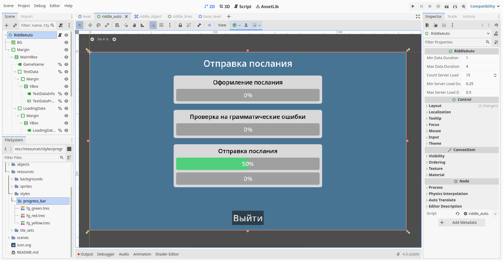
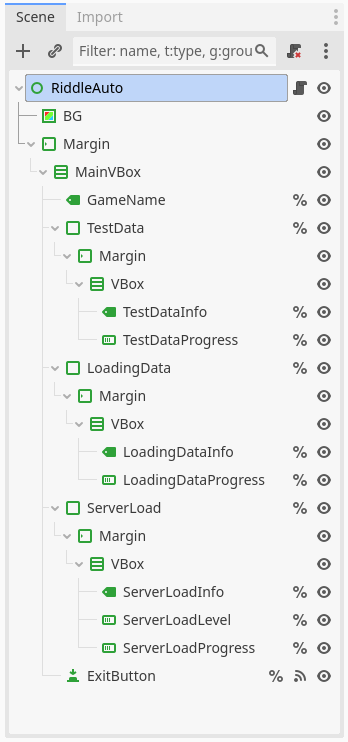
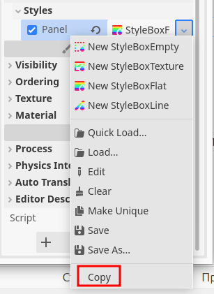

# 2D Платформер

> Часть седьмая

## Содержание

- [1. Загадка "Отправка послания": Описание](#1-отправка-послания-описание)
- [2. Загадка "Отправка послания": Интерфейс](#2-отправка-послания-интерфейс)
- [3. Загадка "Отправка послания": Дизайн](#3-отправка-послания-дизайн)
- [4. Загадка "Отправка послания": Код](#4-отправка-послания-код)
- [5. Дополнение кода `BaseLevel`](#5-дополнение-кода-baselevel)
- [6. Задание](#6-задание)

## 1. Отправка послания: Описание

Данная загадка как таковой загадкой не является. Сцена будет воспроизводить анимацию со случайным значением скорости выполнения каждого этапа анимации для имитации "отправки" некого послания.

<div style="text-align: center;"></div>
<p align="center">Рисунок 1-1 – Представление мини-игры</p>

В конце, мы дополним код `BaseLevel` для полноценной работы "загадки" в игре.

## 2. Отправка послания: Интерфейс

Создадим пустую сцену типа `Control` и назовём её `RiddleAuto`. Давайте сохраним её сразу по такому пути `res://objects/riddles/auto/` и названием файла `riddle_auto.tscn`.

Ниже представлена полная иерархия сцены с мини-игрой.

<div style="text-align: center;"></div>
<p align="center">Рисунок 2-1 – Иерархия сцены</p>

Создадим дочерние объекты у `RiddleAuto`:

- `BG` (тип `ColorRect`; растяните объект на весь размер сцены через панель инструментов; `Color`: `487494`)
- `Margin` (тип `MarginContainer`; растяните объект на весь размер сцены через панель инструментов; вкладка `Theme Overrides` ➡️ вкладка `Constants` ➡️ `Margin Left / Top / Right / Bottom`: `20`)
  - `MainVBox` (тип `VBoxContainer`; вкладка `Layout` ➡️ вкладка `Container Sizing` ➡️ `Horizontal`: `Shrink Center`; вкладка `Theme Overrides` ➡️ вкладка `Constants` ➡️ `Separation`: `25`)
    - `GameName` (тип `Label`; сделать имя уникальным (`%`); `Text`: `Отправка послания`, `Horizontal Alignment`: `Center`, `Vertical Alignment`: `Center`, вкладка `Theme Overrides` ➡️ вкладка `Font Sizes` ➡️ `Font Size`: `36`)
    - `TestData` (тип `PanelContainer`; сделать имя уникальным (`%`); вкладка `Layout` ➡️ `Custom Minimum Size`: `(x: 600, y: 0)`)
      - > Иерархия дочерних узлов объекта `TestData` будет показана отдельно ниже.
    - `LoadingData` (тип `PanelContainer`; сделать имя уникальным (`%`); вкладка `Layout` ➡️ вкладка `Layout` ➡️ `Custom Minimum Size`: `(x: 600, y: 0)`)
      - > Иерархия дочерних узлов объекта `LoadingData` будет показана отдельно ниже.
      - > Узел является результатом дупликации узла `TestData`
      - > Совет: продублируйте узел `TestData` после создания его иерархии дочерних узлов
    - `ServerLoad` (тип `PanelContainer`; сделать имя уникальным (`%`); вкладка `Layout` ➡️ вкладка `Layout` ➡️ `Custom Minimum Size`: `(x: 600, y: 0)`)
      - > Иерархия дочерних узлов объекта `ServerLoad` будет показана отдельно ниже.
      - > Узел является результатом дупликации узла `TestData` или `LoadingData`
      - > Совет: продублируйте узел `TestData` или `LoadingData` после создания его иерархии дочерних узлов
    - `ExitButton` (тип `Button`; сделать имя уникальным (`%`); `Text`: `Выйти`, вкладка `Theme Overrides` ➡️ вкладка `Font Sizes` ➡️ `Font Size`: `36`)

Иерархия дочерних узлов объекта `TestData`:

- `Margin` (тип `MarginContainer`; вкладка `Theme Overrides` ➡️ вкладка `Constants` ➡️ `Margin Left / Top / Right / Bottom`: `10`)
  - `VBox` (тип `VBoxContainer`; вкладка `Theme Overrides` ➡️ вкладка `Constants` ➡️ `Separation`: `10`)
    - `TestDataInfo` (тип `Label`; сделать имя уникальным (`%`); `Text`: `Оформление послания`, `Horizontal Alignment`: `Center`, `Vertical Alignment`: `Center`, вкладка `Theme Overrides` ➡️ вкладка `Font Sizes` ➡️ `Font Size`: `24`, вкладка `Theme Overrides` ➡️ вкладка `Colors` ➡️ `Font Color`: `поставить галочку`)
    - `TestDataProgress` (тип `ProgressBar`; сделать имя уникальным (`%`); вкладка `Layout` ➡️ `Custom Minimum Size`: `(x: 0, y: 50)`)

Иерархия дочерних узлов объекта `LoadingData`:

- `Margin` (тип `MarginContainer`; вкладка `Theme Overrides` ➡️ вкладка `Constants` ➡️ `Margin Left / Top / Right / Bottom`: `10`)
  - `VBox` (тип `VBoxContainer`; вкладка `Theme Overrides` ➡️ вкладка `Constants` ➡️ `Separation`: `10`)
    - `LoadingDataInfo` (тип `Label`; сделать имя уникальным (`%`); `Text`: `Проверка на грамматические ошибки`, `Horizontal Alignment`: `Center`, `Vertical Alignment`: `Center`, вкладка `Theme Overrides` ➡️ вкладка `Font Sizes` ➡️ `Font Size`: `24`, вкладка `Theme Overrides` ➡️ вкладка `Colors` ➡️ `Font Color`: `поставить галочку`)
    - `LoadingDataProgress` (тип `ProgressBar`; сделать имя уникальным (`%`); вкладка `Layout` ➡️ `Custom Minimum Size`: `(x: 0, y: 50)`)

Иерархия дочерних узлов объекта `ServerLoad`:

- `Margin` (тип `MarginContainer`; вкладка `Theme Overrides` ➡️ вкладка `Constants` ➡️ `Margin Left / Top / Right / Bottom`: `10`)
  - `VBox` (тип `VBoxContainer`; вкладка `Theme Overrides` ➡️ вкладка `Constants` ➡️ `Separation`: `10`)
    - `ServerLoadInfo` (тип `Label`; сделать имя уникальным (`%`); `Text`: `Отправка послания`, `Horizontal Alignment`: `Center`, `Vertical Alignment`: `Center`, вкладка `Theme Overrides` ➡️ вкладка `Font Sizes` ➡️ `Font Size`: `24`, вкладка `Theme Overrides` ➡️ вкладка `Colors` ➡️ `Font Color`: `поставить галочку`)
    - `ServerLoadLevel` (тип `ProgressBar`; сделать имя уникальным (`%`); вкладка `Layout` ➡️ `Custom Minimum Size`: `(x: 0, y: 50)`, `Value`: `50`)
    - `ServerLoadProgress` (тип `ProgressBar`; сделать имя уникальным (`%`); вкладка `Layout` ➡️ `Custom Minimum Size`: `(x: 0, y: 50)`)

## 3. Отправка послания: Дизайн

На данный момент обозримый результат не совсем соответствует окончательному результату, представленным выше в документе. Пришло время для редактирования дизайна некоторых узлов посредством редактирования стилей.

Начнём редактировать стиль узла `TestData`, после которого мы сможем скопировать получившийся результат в узлы `LoadingData` и `ServerLoad`. Выделим узел `TestData` в иерархии и перейдём во вкладку `Theme Overrides` ➡️ вкладку `Styles` и в свойстве `Panel` создадим новый `StyleBoxFlat`. Раскроем созданный объект.

Изменим некоторые свойства объекта `StyleBoxFlat`:

- `BG Color`: `d9d9d9`
- Вкладка `Corner Radius` ➡️ `Top Left / Right, Bottom Right / Left`: `8`
- Вкладка `Shadow`
  - `Color`: `00000019`
  - `Size`: `10`
  - `Offset`: `(x: 1, y: 1)`

Теперь нажмём на сам объект `StyleBoxFlat` ПКМ или на иконку стрелки рядом и выберите `Copy`.

<div style="text-align: center;"></div>
<p align="center">Рисунок 3-1 – Контекстное меню</p>

Затем, выделите узел `LoadingData` и / или `ServerLoad`, перейдите в инспекторе во вкладку со стилями и в свойстве `Panel` через контекстное меню вставьте стиль (выберите `Paste`). В результате, мы переместили стиль `TestData` на узел `LoadingData` и `ServerLoad`.

Теперь, начнём изменять стиль для узла `ServerLoadLevel`. Мы создадим стиль заполнения прогресса, цвет которого будет оттенком зелёного и на основе данного стиля создадим ещё два с желтым и красным цветом заполнения прогресса соответственно.

Для начала выделим узел `ServerLoadLevel` в иерархии и перейдём во вкладку `Theme Overrides` ➡️ вкладку `Styles` и в свойстве `Fill` создадим новый `StyleBoxFlat`. Раскроем созданный объект.

Изменим некоторые свойства объекта `StyleBoxFlat`:

- `BG Color`: `00ff5780`
- Вкладка `Corner Radius` ➡️ `Top Left / Right, Bottom Right / Left`: `8`

Теперь нажмём на сам объект `StyleBoxFlat` ПКМ или на иконку стрелки рядом и выберите `Save As...` (💾). Сохраним данный стиль по пути `res://resources/styles/progress_bar/` под названием `fg_green.tres`.

Мы создали стиль заполнения прогресса с зелёным цветом. Создадим новый стиль с жёлтым цветом на основе текущего. Для этого нажмём на стиль в свойстве `Fill` ПКМ или на иконку стрелки рядом и выберите `Make Unique`. Редактор создал копию стиля `fg_green` и вставил её в свойство `Fill`.

Изменим цвет стиля на жёлтый, изменив значение свойства `BG Color`: `fae80d80`. Сохраним данный стиль через `Save As...` из контекстного меню по пути `res://resources/styles/progress_bar/` под названием `fg_yellow.tres`.

Таким же способом создадим новый стиль для красного цвета. Для красного цвета значение свойства `BG Color`: `f5050580`. Сохраните новый стиль по пути `res://resources/styles/progress_bar/` под названием `fg_red.tres`.

## 4. Отправка послания: Код

Создадим скрипт для `RiddleAuto`:

```gdscript
class_name RiddleAuto
extends Control

@onready var game_name: Label = $"%GameName"

@onready var test_data: PanelContainer = $"%TestData"
@onready var test_data_info: Label = $"%TestDataInfo"
@onready var test_data_progress: ProgressBar = $"%TestDataProgress"

@onready var loading_data: PanelContainer = $"%LoadingData"
@onready var loading_data_info: Label = $"%LoadingDataInfo"
@onready var loading_data_progress: ProgressBar = $"%LoadingDataProgress"

@onready var server_load: PanelContainer = $"%ServerLoad"
@onready var server_load_info: Label = $"%ServerLoadInfo"
@onready var server_load_level: ProgressBar = $"%ServerLoadLevel"
@onready var server_load_level_value: float:
	set(value): _set_server_load_level_value(value)

@onready var server_load_progress: ProgressBar = $"%ServerLoadProgress"

@onready var exit_button: Button = $"%ExitButton"

const progress_bar_style_fg_green := preload("res://resources/styles/progress_bar/fg_green.tres")
const progress_bar_style_fg_yellow := preload("res://resources/styles/progress_bar/fg_yellow.tres")
const progress_bar_style_fg_red := preload("res://resources/styles/progress_bar/fg_red.tres")

var is_busy := false
var riddle_object: RiddleObject

var init_test_data_position: Vector2
var init_loading_data_position: Vector2
var init_server_load_position: Vector2

@export var min_data_duration := 1.0
@export var max_data_duration := 4.0

@export var count_server_load_progress := 15
@export var min_server_load_duration := 0.25
@export var max_server_load_duration := 0.5

var random := RandomNumberGenerator.new()

func _ready() -> void:
	Input.mouse_mode = Input.MOUSE_MODE_VISIBLE
	random.randomize()
	
	init_test_data_position = test_data.position
	init_loading_data_position = loading_data.position
	init_server_load_position = server_load.position
	
	_init_config()
	await get_tree().create_timer(1).timeout
	_start_test_data()

func _set_server_load_level_value(value: float) -> void:
	server_load_level.value = value
	
	var previous_style_path = server_load_level.get("theme_override_styles/fill").resource_path
	
	if value >= 0 and value < 50:
		if previous_style_path != progress_bar_style_fg_green.resource_path:
			server_load_level.set("theme_override_styles/fill", progress_bar_style_fg_green)
	elif value >= 50 and value < 70:
		if previous_style_path != progress_bar_style_fg_yellow.resource_path:
			server_load_level.set("theme_override_styles/fill", progress_bar_style_fg_yellow)
	else:
		if previous_style_path != progress_bar_style_fg_red.resource_path:
			server_load_level.set("theme_override_styles/fill", progress_bar_style_fg_red)

func _get_server_load_level_value() -> float:
	return server_load_level.value

func _init_config():
	test_data.position = init_test_data_position
	test_data.modulate = Color.GRAY
	test_data.modulate.a = 0.0
	
	test_data_progress.value = 0
	
	loading_data.position = init_loading_data_position
	loading_data.modulate = Color.GRAY
	loading_data.modulate.a = 0.0
	
	loading_data_progress.value = 0
	
	server_load.position = init_server_load_position
	server_load.modulate = Color.GRAY
	server_load.modulate.a = 0.0
	
	server_load_level.value = 0
	server_load_level.add_theme_stylebox_override("theme_override_styles/fill", progress_bar_style_fg_green)
	
	server_load_progress.value = 0

func _show_window(window: Control) -> void:
	await get_tree().process_frame
	var animation_window = create_tween()
	var previous_position = window.position
	var offset_position = Vector2(0, 100)
	
	animation_window.parallel().tween_property(window, "position", previous_position, 0.5).from(previous_position - offset_position).set_trans(Tween.TRANS_SINE).set_ease(Tween.EASE_OUT)
	animation_window.parallel().tween_property(window, 'modulate', Color.WHITE, 0.5).from(Color.GRAY).set_trans(Tween.TRANS_SINE).set_ease(Tween.EASE_OUT)
	animation_window.parallel().tween_property(window, 'modulate:a', 1.0, 0.5).from(0.0).set_trans(Tween.TRANS_SINE).set_ease(Tween.EASE_OUT)
	animation_window.play()
	await animation_window.finished
	animation_window.stop()

func _data_animation(window_progress: Control) -> void:
	await get_tree().process_frame
	var duration_array := []
	var progress_array := []
	
	for _i in range(4):
		duration_array.append(random.randf_range(min_data_duration, max_data_duration))
	
	var progress_1 := random.randi_range(1, 25)
	var progress_2 := random.randi_range(1, 25)
	var progress_3 := random.randi_range(1, 25)
	var progress_4 := 100 - (progress_1 + progress_2 + progress_3)
	
	progress_array.append_array([progress_1, progress_2, progress_3, progress_4])
	
	print("Duration Array: ", duration_array)
	print("Progress Array: ", progress_array)
	
	for i in range(4):
		var animation = create_tween()
		var previous_value = window_progress.value
		var final_value = previous_value + progress_array[i]
		print("Previous Value: ", previous_value)
		print("Final Value: ", final_value)
		print("Current Duration Array: ", duration_array[i])
		print("Current Progress Array: ", progress_array[i])
		animation.tween_property(window_progress, 'value', final_value, duration_array[i]).from_current()
		animation.play()
		await animation.finished
		animation.stop()

func _start_test_data() -> void:
	is_busy = true
	await _show_window(test_data)
	await _data_animation(test_data_progress)
	
	await get_tree().create_timer(0.5).timeout
	_start_loading_data()

func _start_loading_data() -> void:
	await _show_window(loading_data)
	await _data_animation(loading_data_progress)
	
	await get_tree().create_timer(0.5).timeout
	_start_server_load()

func _start_server_load() -> void:
	await _show_window(server_load)
	
	var duration_array := []
	var load_array := []
	
	for _i in range(count_server_load_progress):
		duration_array.append(random.randf_range(min_server_load_duration, max_server_load_duration))
	
	for _i in range(count_server_load_progress):
		load_array.append(random.randi_range(0, 100))
	
	server_load_progress.max_value = count_server_load_progress
	
	print("Duration Array: ", duration_array)
	print("Load Array: ", load_array)
	
	for i in range(load_array.size()):
		var animation = create_tween()
		var previous_value = _get_server_load_level_value()
		print("Final Value: ", load_array[i])
		print("Current Duration Array: ", duration_array[i])
		animation.parallel().tween_method(_set_server_load_level_value, previous_value, float(load_array[i]), duration_array[i])
		animation.parallel().tween_property(server_load_progress, 'value', i, duration_array[i]).from_current()
		animation.play()
		await animation.finished
		animation.stop()
	
	var all_load: int = 0
	var average_load: int
	for i in load_array:
		all_load += i
	average_load = int(float(all_load) / load_array.size())
	print("Average Load: ", average_load)
	
	var animation = create_tween()
	var previous_value = _get_server_load_level_value()
	animation.parallel().tween_property(server_load_level, 'value', 0, 1).from_current()
	animation.parallel().tween_method(_set_server_load_level_value, previous_value, float(0), 1)
	animation.parallel().tween_property(server_load_progress, 'value', server_load_progress.max_value, 1).from_current()
	animation.play()
	await animation.finished
	animation.stop()
	is_busy = false
	_closing()

func _hide_window(window: Control) -> void:
	await get_tree().process_frame
	var animation_window = create_tween()
	var previous_position = window.position
	var offset_position = Vector2(0, 100)
	
	animation_window.parallel().tween_property(window, "position", previous_position - offset_position, 0.5).from(previous_position).set_trans(Tween.TRANS_SINE).set_ease(Tween.EASE_OUT)
	animation_window.parallel().tween_property(window, 'modulate', Color.GRAY, 0.5).from(Color.WHITE).set_trans(Tween.TRANS_SINE).set_ease(Tween.EASE_OUT)
	animation_window.parallel().tween_property(window, 'modulate:a', 0.0, 0.5).from(1.0).set_trans(Tween.TRANS_SINE).set_ease(Tween.EASE_OUT)
	animation_window.play()
	await animation_window.finished
	animation_window.stop()

func _closing() -> void:
	exit_button.disabled = true
	
	await get_tree().create_timer(1.0).timeout
	
	if is_busy:
		Input.mouse_mode = Input.MOUSE_MODE_CAPTURED
		EventBus.set_busy_player.emit(false)
		queue_free()
	else:
		await _hide_window(server_load)
		await _hide_window(loading_data)
		await _hide_window(test_data)
		
		EventBus.riddle_solved.emit(riddle_object)
		
		Input.mouse_mode = Input.MOUSE_MODE_CAPTURED
		EventBus.set_busy_player.emit(false)
		queue_free()

func _on_exit_button_pressed() -> void:
	_closing()
```

## 5. Дополнение кода `BaseLevel`

Дополним код `BaseLevel`:

> Новые строчки кода будут помечаться комментарием `#!`, отредактированные строчки - `#?`

```gdscript
class_name BaseLevel
extends Node2D

# Интерфейсы загадок
const RIDDLE_LINES := preload("res://objects/riddles/lines/riddle_lines.tscn")
#! Новая переменная
const RIDDLE_AUTO := preload("res://objects/riddles/auto/riddle_auto.tscn")

# Новые команды в условии `RiddleObject.RiddleType.AUTO`
func open_riddle(riddle: RiddleObject) -> void:
	var riddle_ui: Control
	match riddle.riddle_type:
		RiddleObject.RiddleType.LINES:
			print("Открывается загадка \"Соединение Линий\"")
			riddle_ui = RIDDLE_LINES.instantiate() as RiddleLines
			riddle_ui.riddle_object = riddle
		RiddleObject.RiddleType.DUBLICATES:
			print("Открывается загадка \"Удаление Дубликатов\"")
		RiddleObject.RiddleType.AUTO:
			print("Открывается загадка \"Отправка послания\"")
			#! Новые команды
			riddle_ui = RIDDLE_AUTO.instantiate() as RiddleAuto
			riddle_ui.riddle_object = riddle
	
	_riddles.add_child(riddle_ui)
```

Чтобы проверить новую мини-игру, измените у узла `RiddleObject` значение свойства `Riddle Type`: `Auto`.

## 6. Задание

1. Измените стиль кнопки `ExitButton` в сцене `RiddleLines` и `RiddleAuto` соответственно.