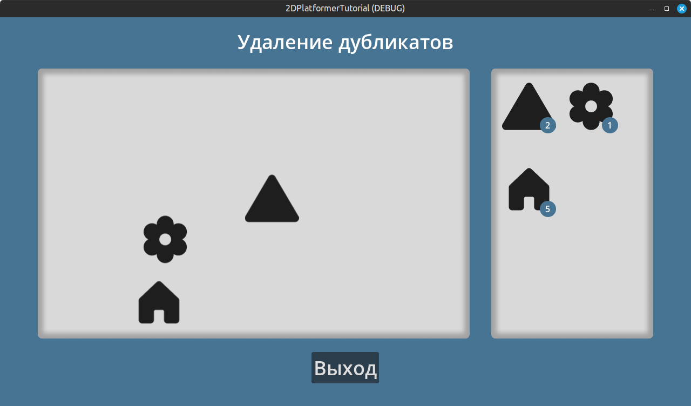

# 2D Платформер

> Часть восьмая

## Содержание

- [1. Исправление кода у `RiddleObject`](#1-исправление-кода-у-riddleobject)
- [2. Подготовка](#2-подготовка)
- [3. Создание `RiddleDuplicates`](#3-создание-riddleduplicates)
- [4. Код `RiddleDuplicates`](#4-код-riddleduplicates)
- [5. Создание объекта `DuplicateItemParticles`](#5-создание-объекта-duplicateitemparticles)
- [6. Код объекта `DuplicateItemParticles`](#6-код-объекта-duplicateitemparticles)
- [7. Создание объекта `Duplicate`](#7-создание-объекта-duplicate)
- [8. Код объекта `Duplicate`](#8-код-объекта-duplicate)
- [9. Создание `DuplicateItem`](#9-создание-duplicateitem)
- [10. Код `DuplicateItem`](#10-код-duplicateitem)
- [11. Дополнение кода у `BaseLevel`](#11-дополнение-кода-у-baselevel)

## 1. Исправление кода у `RiddleObject`

[К Содержанию](#содержание)

Измените строчку кода у объекта `RiddleObject`:

```gdscript
# Старая строка            ⬇
enum RiddleType { LINES, DUBLICATES, AUTO }
# Новая строка             ⬇
enum RiddleType { LINES, DUPLICATES, AUTO }
```

## 2. Подготовка

[К Содержанию](#содержание)

Скопируйте папку `delete_duplicates_game` с новыми ресурсами из папки `resources/sprites/`, которая расположена рядом с документом, и вставьте папку в проект, соблюдая изначальное местонахождение скопированной папки.

## 3. Создание `RiddleDuplicates`

[К Содержанию](#содержание)

Новая мини-игра будет представлять из себя игровой процесс, в котором нужно убрать все фигуры из игрового поля.

<div style="text-align: center;"></div>
<p align="center">Рисунок 3-1 – Представление мини-игры</p>

Создадим пустую сцену типа `Control` и назовём её `RiddleDuplicates`. Давайте сохраним её сразу по такому пути `res://objects/riddles/duplicates/` и названием файла `riddle_duplicates.tscn`.

Создадим дочерние объекты у `RiddleDuplicates`:

- `BG` (тип `ColorRect`; растяните объект на весь размер сцены через панель инструментов; `Color`: `487494`)
- `Margin` (тип `MarginContainer`; растяните объект на весь размер сцены через панель инструментов; вкладка `Theme Overrides` ➡️ вкладка `Constants` ➡️ `Margin Left / Top / Right / Bottom`: `20`)
  - `MainVBox` (тип `VBoxContainer`; сделать имя уникальным (`%`); вкладка `Layout` ➡️ вкладка `Container Sizing` ➡️ `Horizontal`: `Shrink Center`; вкладка `Theme Overrides` ➡️ вкладка `Constants` ➡️ `Separation`: `25`)
    - `GameName` (тип `Label`; сделать имя уникальным (`%`); `Text`: `Отправка послания`, `Horizontal Alignment`: `Center`, `Vertical Alignment`: `Center`, вкладка `Theme Overrides` ➡️ вкладка `Font Sizes` ➡️ `Font Size`: `36`)
    - `HBox` (тип `HBoxContainer`; вкладка `Theme Overrides` ➡️ вкладка `Constants` ➡️ `Separation`: `40`)
      - `GameArea` (тип `TextureRect`; `Texture`: файл `res://resources/sprites/delete_duplicates_game/game_area.png`)
        - > Иерархия дочерних узлов объекта `GameArea` будет показана отдельно ниже.
      - `ExtraArea` (тип `TextureRect`; `Texture`: файл `res://resources/sprites/delete_duplicates_game/extra_area.png`)
        - > Иерархия дочерних узлов объекта `ExtraArea` будет показана отдельно ниже.
    - `ExitButton` (тип `Button`; сделать имя уникальным (`%`); `Text`: `Выйти`, вкладка `Theme Overrides` ➡️ вкладка `Font Sizes` ➡️ `Font Size`: `36`)

Иерархия дочерних узлов объекта `GameArea`:

- `SubViewportContainer` (растяните объект на весь размер сцены через панель инструментов)
  - `SubViewport` (сделать имя уникальным (`%`); `Size`: `(x: 800, y: 500)`, вкладка `Render Target` ➡️ `Update Mode`: `Always`, `Transparent BG`: `true`, `Handle Input Locally`: `false`, вкладка `Physics` ➡️ `Object Picking`: `true`)
    - `GameZone` (тип `Node2D`; сделать имя уникальным (`%`))
      - `Objects` (тип `Node2D`; сделать имя уникальным (`%`))
      - `WallTop` (тип `StaticBody2D`; вкладка `Collision` ➡️ `Mask`: убрать слой `1` и добавить слой `2`, вкладка `Transform` ➡️ `Position`: `(x: 400, y: 0)`)
        - `Collision` (тип `CollisionShape2D`; `Shape`: создать `RectangleShape2D` ➡️ `Size`: `(x: 800, y: 20)`)
      - `WallBottom` (тип `StaticBody2D`; дубликат объекта `WallTop`; вкладка `Transform` ➡️ `Position`: `(x: 400, y: 500)`)
      - `WallLeft` (тип `StaticBody2D`; дубликат объекта `WallBottom`; вкладка `Transform` ➡️ `Position`: `(x: 0, y: 250)`, вкладка `Transform` ➡️ `Rotation`: `90`)
      - `WallRight` (тип `StaticBody2D`; дубликат объекта `WallLeft`; вкладка `Transform` ➡️ `Position`: `(x: 800, y: 250)`)
- `GameAreaShadow` (тип `TextureRect`; растяните объект на весь размер сцены через панель инструментов; `Texture`: файл `res://resources/sprites/delete_duplicates_game/game_area_shadow.png`)

Иерархия дочерних узлов объекта `ExtraArea`:

- `Margin` (тип `MarginContainer`; растяните объект на весь размер сцены через панель инструментов; вкладка `Theme Overrides` ➡️ вкладка `Constants` ➡️ `Margin Left / Top / Right / Bottom`: `20`)
  - `ItemList` (тип `HFlowContainer`; сделать имя уникальным (`%`); вкладка `Theme Overrides` ➡️ вкладка `Constants` ➡️ `H Separation`: `15`, вкладка `Theme Overrides` ➡️ вкладка `Constants` ➡️ `V Separation`: `55`)
- `ExtraAreaShadow` (тип `TextureRect`; растяните объект на весь размер сцены через панель инструментов; `Texture`: файл `res://resources/sprites/delete_duplicates_game/extra_area_shadow.png`)

<div style="text-align: center;"></div>
<p align="center">Рисунок 3-2 – Иерархия `RiddleDuplicates`</p>

## 4. Код `RiddleDuplicates`

[К Содержанию](#содержание)

Создадим скрипт для `RiddleDuplicates`:

```gdscript
class_name RiddleDuplicates
extends Control

enum DuplicateItems { Square, Circle, Triangle, Star, House, Heart, Moon, Flower }

const DUPLICATE_ITEM := preload("res://objects/riddles/duplicates/duplicate_item/duplicate_item.tscn")
const DUPLICATE_OBJECT := preload("res://objects/riddles/duplicates/duplicate/duplicate.tscn")

static var square_sprite := preload("res://resources/sprites/delete_duplicates_game/tabler_square-filled.png")
static var square_sprite_hover := preload("res://resources/sprites/delete_duplicates_game/tabler_square-filled_hover.png")
static var circle_sprite := preload("res://resources/sprites/delete_duplicates_game/gravity-ui_circle-fill.png")
static var circle_sprite_hover := preload("res://resources/sprites/delete_duplicates_game/gravity-ui_circle-fill_hover.png")
static var triangle_sprite := preload("res://resources/sprites/delete_duplicates_game/bi_triangle-fill.png")
static var triangle_sprite_hover := preload("res://resources/sprites/delete_duplicates_game/bi_triangle-fill_hover.png")
static var star_sprite := preload("res://resources/sprites/delete_duplicates_game/tdesign_star-filled.png")
static var star_sprite_hover := preload("res://resources/sprites/delete_duplicates_game/tdesign_star-filled_hover.png")
static var house_sprite := preload("res://resources/sprites/delete_duplicates_game/ph_house-fill.png")
static var house_sprite_hover := preload("res://resources/sprites/delete_duplicates_game/ph_house-fill_hover.png")
static var heart_sprite := preload("res://resources/sprites/delete_duplicates_game/tabler_heart-filled.png")
static var heart_sprite_hover := preload("res://resources/sprites/delete_duplicates_game/tabler_heart-filled_hover.png")
static var moon_sprite := preload("res://resources/sprites/delete_duplicates_game/ph_moon-fill.png")
static var moon_sprite_hover := preload("res://resources/sprites/delete_duplicates_game/ph_moon-fill_hover.png")
static var flower_sprite := preload("res://resources/sprites/delete_duplicates_game/ph_flower-fill.png")
static var flower_sprite_hover := preload("res://resources/sprites/delete_duplicates_game/ph_flower-fill_hover.png")

@onready var game_name: Label = %GameName
@onready var main_v_box: VBoxContainer = %MainVBox
@onready var game_zone: Node2D = %GameZone
@onready var objects: Node2D = %Objects
@onready var item_list: HFlowContainer = %ItemList
@onready var exit_button: Button = %ExitButton
@onready var viewport: SubViewport = %SubViewport

var min_duplicate_items := 1
var max_duplicate_items := DuplicateItems.size()

@export var duplicate_items := 3
@export var min_duplicate_items_count := 1
@export var max_duplicate_items_count := 5
@export var mouse_point_size := 20.0

var riddle_object: RiddleObject
var items := []
var duplicate_entered: Node2D
var magic_vector: Vector2 # выравнивает позицию мыши внутри SubViewport
var game_passed := false

var shape_info = CircleShape2D.new()
var shape_param = PhysicsShapeQueryParameters2D.new()

var random := RandomNumberGenerator.new()

func _ready() -> void:
	random.randomize()
	_config()
	_generate_items()

func delete_duplicates() -> void:
	objects.get_children().any(queue_free)

func _config() -> void:
	Input.mouse_mode = Input.MOUSE_MODE_VISIBLE
	delete_duplicates()
	
	shape_info.radius = mouse_point_size
	shape_param.shape_rid = shape_info.get_rid()
	
	duplicate_items = int(clamp(duplicate_items, min_duplicate_items, max_duplicate_items))

func _generate_items() -> void:
	items = []
	var counts := []
	
	for i in range(DuplicateItems.size()):
		items.append(i)
		var count = random.randi_range(min_duplicate_items_count, max_duplicate_items_count)
		counts.append(count)
	
	items.shuffle()
	counts.shuffle()
	
	for _i in range(DuplicateItems.size() - duplicate_items):
		items.pop_front()
		counts.pop_front()
	
	for i in range(items.size()):
		var item = DUPLICATE_ITEM.instantiate() as DuplicateItem
		item.id_item = items[i]
		item.count = counts[i]
		item_list.add_child(item)
	
	_generate_duplicate_items()

func _generate_duplicate_items() -> void:
	delete_duplicates()
	for id in items:
		_spawn_duplicate(id)

func _spawn_duplicate(id: int) -> void:
	var min_position_x := 100.0
	var max_position_x := 700.0
	
	var min_position_y := 100.0
	var max_position_y := 400.0
	
	var obj = DUPLICATE_OBJECT.instantiate()
	var random_position := Vector2(
		random.randf_range(min_position_x, max_position_x),
		random.randf_range(min_position_y, max_position_y)
	)
	obj.id_item = id
	obj.global_position = random_position
	objects.add_child(obj)

func _check_duplicate(duplicate_object: Node2D) -> void:
	for item in item_list.get_children():
		if item.id_item == duplicate_object.id_item:
			var id = duplicate_object.id_item
			item.count -= 1
			item.call_deferred("ui_update")
			if item.count < 1:
				item.call_deferred("queue_free")
				duplicate_object.queue_free()
			else:
				duplicate_object.queue_free()
				_spawn_duplicate(id)
			break

func _process(_delta: float) -> void:
	if Input.is_action_just_pressed("click") and not game_passed:
		if is_instance_valid(duplicate_entered):
			_check_duplicate(duplicate_entered)
	
	if item_list.get_child_count() < 1:
		game_passed = true
		exit_button.disabled = true
		await get_tree().create_timer(1.0).timeout
		Input.mouse_mode = Input.MOUSE_MODE_CAPTURED
		EventBus.riddle_solved.emit(riddle_object)
		queue_free()
	else:
		game_passed = false

func shape_cast() -> void:
	magic_vector = Vector2(main_v_box.position.x, 105)
	
	var direct_state = viewport.world_2d.direct_space_state
	shape_param.transform.origin = get_global_mouse_position() - magic_vector
	var shape = direct_state.intersect_shape(shape_param)
	
	if shape.size() > 0:
		var info = shape[0] as Dictionary
		if info.has("collider"):
			var obj = info["collider"] as Node2D
			if obj.is_in_group("duplicate"):
				if is_instance_valid(duplicate_entered):
					duplicate_entered.call_deferred("normal")
					duplicate_entered = obj
					duplicate_entered.call_deferred("hover")
				else:
					duplicate_entered = obj
					duplicate_entered.call_deferred("hover")
		else:
			if is_instance_valid(duplicate_entered):
				duplicate_entered.call_deferred("normal")
				duplicate_entered = null
	else:
		if is_instance_valid(duplicate_entered):
			duplicate_entered.call_deferred("normal")
			duplicate_entered = null

func _physics_process(_delta: float) -> void:
	shape_cast()

func _on_exit_button_pressed() -> void:
	Input.mouse_mode = Input.MOUSE_MODE_CAPTURED
	EventBus.set_busy_player.emit(false)
	queue_free()
```

## 5. Создание объекта `DuplicateItemParticles`

[К Содержанию](#содержание)

Создадим пустую сцену типа `CPUParticles2D` и назовём её `DuplicateItemParticles`. Давайте сохраним её сразу по такому пути `res://objects/riddles/duplicates/duplicate_item/particles/` и названием файла `duplicate_item_particles.tscn`.

Изменяем следующие свойства:

- `Emitting`: `false`
- `Amount`: `16`
- Вкладка `Time`
  - `One Shot`: `true`
  - `Explosiveness`: `1`
- Вкладка `Drawing`
  - `Local Coords`: `true`
- Вкладка `Direction`
  - `Direction`: `(x: 0, y: 0)`
  - `Spread`: `180`
- Вкладка `Initial Velocity`
  - `Velocity Min`: `50`
  - `Velocity Max`: `360`
- Вкладка `Angular Velocity`
  - `Velocity Min`: `10`
  - `Velocity Max`: `45`
- Вкладка `Linear Accel`
  - `Accel Min`: `10`
  - `Accel Max`: `45`
- Вкладка `Radial Accel`
  - `Accel Min`: `50`
  - `Accel Max`: `80`
- Вкладка `Angle`
  - `Angle Min`: `10`
  - `Angle Max`: `360`
- Вкладка `Scale`
  - `Scale Amount Curve`: создать `Curve` ➡️ включить привязку по сетке (иконка сетки с магнитом) и в графике создать первую точку с высотой `0.5` и положением `0` (ось `X`), и вторую точку с высотой `0` и положением `1`

## 6. Код объекта `DuplicateItemParticles`

[К Содержанию](#содержание)

Создадим скрипт для `DuplicateItemParticles`:

```gdscript
extends CPUParticles2D

var id_item: int

func _ready() -> void:
	_init_texture()
	emitting = true

func _init_texture() -> void:
	match id_item:
		RiddleDuplicates.DuplicateItems.Square:
			texture = RiddleDuplicates.square_sprite
		RiddleDuplicates.DuplicateItems.Circle:
			texture = RiddleDuplicates.circle_sprite
		RiddleDuplicates.DuplicateItems.Triangle:
			texture = RiddleDuplicates.triangle_sprite
		RiddleDuplicates.DuplicateItems.Star:
			texture = RiddleDuplicates.star_sprite
		RiddleDuplicates.DuplicateItems.House:
			texture = RiddleDuplicates.house_sprite
		RiddleDuplicates.DuplicateItems.Heart:
			texture = RiddleDuplicates.heart_sprite
		RiddleDuplicates.DuplicateItems.Moon:
			texture = RiddleDuplicates.moon_sprite
		RiddleDuplicates.DuplicateItems.Flower:
			texture = RiddleDuplicates.flower_sprite

func _process(_delta: float) -> void:
	if not emitting:
		queue_free()
```

## 7. Создание объекта `Duplicate`

[К Содержанию](#содержание)

Создадим пустую сцену типа `CharacterBody2D` и назовём её `Duplicate`. Давайте сохраним её сразу по такому пути `res://objects/riddles/duplicates/duplicate/` и названием файла `duplicate.tscn`.

Добавим узел `Duplicate` в группу `duplicate`. Изменим свойство `Layer` во вкладке `Collision`: уберём слой `1` и добавим слой `2`.

Создадим дочерние объекты у `Duplicate`: 

- `Sprite` (тип `Sprite2D`; сделать имя уникальным (`%`))
- > Остальные узлы проговорим отдельно, но общие моменты будут указаны ниже
- `CircleCollision` (тип `CollisionShape2D`; сделать имя уникальным (`%`); `Disabled`: `true`, вкладка `Visibility` ➡️ `Visible`: `false`)
- `SquareCollision` (тип `CollisionShape2D`; сделать имя уникальным (`%`); `Disabled`: `true`, вкладка `Visibility` ➡️ `Visible`: `false`)
- `TriangleCollision` (тип `CollisionPolygon2D`; сделать имя уникальным (`%`); `Disabled`: `true`, вкладка `Visibility` ➡️ `Visible`: `false`)
- `FlowerCollision` (тип `CollisionPolygon2D`; сделать имя уникальным (`%`); `Disabled`: `true`, вкладка `Visibility` ➡️ `Visible`: `false`)
- `HouseCollision` (тип `CollisionPolygon2D`; сделать имя уникальным (`%`); `Disabled`: `true`, вкладка `Visibility` ➡️ `Visible`: `false`)
- `MoonCollision` (тип `CollisionPolygon2D`; сделать имя уникальным (`%`); `Disabled`: `true`, вкладка `Visibility` ➡️ `Visible`: `false`)
- `HeartCollision` (тип `CollisionPolygon2D`; сделать имя уникальным (`%`); `Disabled`: `true`, вкладка `Visibility` ➡️ `Visible`: `false`)
- `StarCollision` (тип `CollisionPolygon2D`; сделать имя уникальным (`%`); `Disabled`: `true`, вкладка `Visibility` ➡️ `Visible`: `false`)    

<div style="text-align: center;"></div>
<p align="center">Рисунок 7-1 – Иерархия `Duplicate`</p>

Узлы `CircleCollision` и `SquareCollision` можно просто создать и в свойстве `Shape` создать `CircleShape2D` для `CircleCollision` и `RectangleShape2D` для `SquareCollision` соответственно. Для `CircleShape2D` свойство `Radius`: `45`, для `RectangleShape2D` свойство `Size`: `(x: 85, y: 85)`.

Чтобы создать `TriangleCollision`, нужно подготовить объект `Sprite`, задав для него свойство `Texture`: файл `res://resources/sprites/delete_duplicates_game/bi_triangle-fill.png`. Затем в панели инструментов нажать на кнопку `Sprite2D` и в выпадающем списке выбрать `Create CollisionPolygon2D Sibling`. В открывшемся окне выставить значения, подобные рисунку 5-2 или на свои собственные и нажать кнопку `Create CollisionPolygon2D`. Переименуйте созданный объект на `TriangleCollision` и измените свойства согласно вышеописанной иерархии.

<div style="text-align: center;"></div>
<p align="center">Рисунок 7-2 – Окно создания `CollisionPolygon2D` из спрайта</p>

Чтобы создать `FlowerCollision`, нужно подготовить объект `Sprite`, задав для него свойство `Texture`: файл `res://resources/sprites/delete_duplicates_game/ph_flower-fill.png`. Затем в панели инструментов нажать на кнопку `Sprite2D` и в выпадающем списке выбрать `Create CollisionPolygon2D Sibling`. В открывшемся окне выставить значения, подобные рисунку 5-3 или на свои собственные и нажать кнопку `Create CollisionPolygon2D`. Переименуйте созданный объект на `FlowerCollision` и измените свойства согласно вышеописанной иерархии.

<div style="text-align: center;"></div>
<p align="center">Рисунок 7-3 – Окно создания `CollisionPolygon2D` из спрайта</p>

Чтобы создать `HouseCollision`, нужно подготовить объект `Sprite`, задав для него свойство `Texture`: файл `res://resources/sprites/delete_duplicates_game/ph_house-fill.png`. Затем в панели инструментов нажать на кнопку `Sprite2D` и в выпадающем списке выбрать `Create CollisionPolygon2D Sibling`. В открывшемся окне выставить значения, подобные из предыдущих вариантов или на свои собственные и нажать кнопку `Create CollisionPolygon2D`. Переименуйте созданный объект на `HouseCollision` и измените свойства согласно вышеописанной иерархии.

Чтобы создать `MoonCollision`, нужно подготовить объект `Sprite`, задав для него свойство `Texture`: файл `res://resources/sprites/delete_duplicates_game/ph_moon-fill.png`. Затем в панели инструментов нажать на кнопку `Sprite2D` и в выпадающем списке выбрать `Create CollisionPolygon2D Sibling`. В открывшемся окне выставить значения, подобные из предыдущих вариантов или на свои собственные и нажать кнопку `Create CollisionPolygon2D`. Переименуйте созданный объект на `MoonCollision` и измените свойства согласно вышеописанной иерархии.

Чтобы создать `HeartCollision`, нужно подготовить объект `Sprite`, задав для него свойство `Texture`: файл `res://resources/sprites/delete_duplicates_game/tabler_heart-filled.png`. Затем в панели инструментов нажать на кнопку `Sprite2D` и в выпадающем списке выбрать `Create CollisionPolygon2D Sibling`. В открывшемся окне выставить значения, подобные из предыдущих вариантов или на свои собственные и нажать кнопку `Create CollisionPolygon2D`. Переименуйте созданный объект на `HeartCollision` и измените свойства согласно вышеописанной иерархии.

Чтобы создать `StarCollision`, нужно подготовить объект `Sprite`, задав для него свойство `Texture`: файл `res://resources/sprites/delete_duplicates_game/tdesign_star-filled.png`. Затем в панели инструментов нажать на кнопку `Sprite2D` и в выпадающем списке выбрать `Create CollisionPolygon2D Sibling`. В открывшемся окне выставить значения, подобные из предыдущих вариантов или на свои собственные и нажать кнопку `Create CollisionPolygon2D`. Переименуйте созданный объект на `StarCollision` и измените свойства согласно вышеописанной иерархии.

## 8. Код объекта `Duplicate`

[К Содержанию](#содержание)

Создадим скрипт для `Duplicate`:

```gdscript
extends CharacterBody2D

const DUPLICATE_ITEM_PARTICLES := preload("res://objects/riddles/duplicates/duplicate_item/particles/duplicate_item_particles.tscn")

@onready var sprite: Sprite2D = %Sprite
@onready var circle_collision: CollisionShape2D = %CircleCollision
@onready var square_collision: CollisionShape2D = $%SquareCollision
@onready var triangle_collision: CollisionPolygon2D = %TriangleCollision
@onready var flower_collision: CollisionPolygon2D = %FlowerCollision
@onready var house_collision: CollisionPolygon2D = %HouseCollision
@onready var moon_collision: CollisionPolygon2D = %MoonCollision
@onready var heart_collision: CollisionPolygon2D = %HeartCollision
@onready var star_collision: CollisionPolygon2D = %StarCollision

@export var min_velocity_speed := 100.0
@export var max_velocity_speed := 200.0

var id_item: int

var normal_texture: Texture
var hover_texture: Texture

var random := RandomNumberGenerator.new()
var particles = DUPLICATE_ITEM_PARTICLES.instantiate()

func _ready() -> void:
	random.randomize()
	velocity = Vector2()
	_randomize_velocity()
	_randomize_velocity_direction()
	_init_texture()
	particles.id_item = id_item

func _randomize_velocity() -> void:
	velocity = Vector2(
		random.randf_range(min_velocity_speed, max_velocity_speed),
		random.randf_range(min_velocity_speed, max_velocity_speed)
	)

func _randomize_velocity_direction() -> void:
	match random.randi_range(0, 2):
		0:
			velocity.x *= -1
			velocity.y *= -1
		1:
			velocity.x *= -1
		2:
			velocity.y *= -1

func _init_texture() -> void:
	match id_item:
		RiddleDuplicates.DuplicateItems.Square:
			add_to_group("square")
			normal_texture = RiddleDuplicates.square_sprite
			hover_texture = RiddleDuplicates.square_sprite_hover
			square_collision.show()
			square_collision.disabled = false
		RiddleDuplicates.DuplicateItems.Circle:
			add_to_group("circle")
			normal_texture = RiddleDuplicates.circle_sprite
			hover_texture = RiddleDuplicates.circle_sprite_hover
			circle_collision.show()
			circle_collision.disabled = false
		RiddleDuplicates.DuplicateItems.Triangle:
			add_to_group("triangle")
			normal_texture = RiddleDuplicates.triangle_sprite
			hover_texture = RiddleDuplicates.triangle_sprite_hover
			triangle_collision.show()
			triangle_collision.disabled = false
		RiddleDuplicates.DuplicateItems.Star:
			add_to_group("star")
			normal_texture = RiddleDuplicates.star_sprite
			hover_texture = RiddleDuplicates.star_sprite_hover
			star_collision.show()
			star_collision.disabled = false
		RiddleDuplicates.DuplicateItems.House:
			add_to_group("house")
			normal_texture = RiddleDuplicates.house_sprite
			hover_texture = RiddleDuplicates.house_sprite_hover
			house_collision.show()
			house_collision.disabled = false
		RiddleDuplicates.DuplicateItems.Heart:
			add_to_group("heart")
			normal_texture = RiddleDuplicates.heart_sprite
			hover_texture = RiddleDuplicates.heart_sprite_hover
			heart_collision.show()
			heart_collision.disabled = false
		RiddleDuplicates.DuplicateItems.Moon:
			add_to_group("moon")
			normal_texture = RiddleDuplicates.moon_sprite
			hover_texture = RiddleDuplicates.moon_sprite_hover
			moon_collision.show()
			moon_collision.disabled = false
		RiddleDuplicates.DuplicateItems.Flower:
			add_to_group("flower")
			normal_texture = RiddleDuplicates.flower_sprite
			hover_texture = RiddleDuplicates.flower_sprite_hover
			flower_collision.show()
			flower_collision.disabled = false
	sprite.texture = normal_texture

func _physics_process(delta: float) -> void:
	var collision_info = move_and_collide(velocity * delta)
	if collision_info:
		velocity = velocity.bounce(collision_info.get_normal())

func hover() -> void:
	sprite.texture = hover_texture

func normal() -> void:
	sprite.texture = normal_texture

func _exit_tree() -> void:
	particles.global_position = global_position
	get_parent().call_deferred("add_child", particles)
```

## 9. Создание `DuplicateItem`

[К Содержанию](#содержание)

Создадим пустую сцену типа `Control` и назовём её `DuplicateItem`. Давайте сохраним её сразу по такому пути `res://objects/riddles/duplicates/duplicate_item/` и названием файла `duplicate_item.tscn`.

Изменим свойство `Custom Minimum Size` во вкладке `Layout`: `(x: 100, y: 100)` и свойство `Anchors Preset`: `Top Left`.

Создадим дочерние объекты у `DuplicateItem`: 

- `DuplicateRect` (тип `TextureRect`; сделать имя уникальным (`%`); растяните объект на весь размер через панель инструментов)
  - `CountRect` (тип `TextureRect`; `Texture`: файл `res://resources/sprites/delete_duplicates_game/count.png`, вкладка `Transform` ➡️ `Size`: `(x: 30, y: 30)`, вкладка `Layout` ➡️ `Layout Mode`: `Anchors`, вкладка `Layout` ➡️ `Anchors Preset`: `Bottom Right`)
    - `CountInfo` (тип `Label`; сделать имя уникальным (`%`); растяните объект на весь размер через панель инструментов; `Horizontal Alignment`: `Center`, `Vertical Alignment`: `Center`)

## 10. Код `DuplicateItem`

[К Содержанию](#содержание)

Создадим скрипт для `DuplicateItem`:

```gdscript
class_name DuplicateItem
extends Control

@onready var duplicate_rect: TextureRect = $"%DuplicateRect"
@onready var count_info: Label = $"%CountInfo"

var id_item: int
var count: int

func _ready() -> void:
	_init_texture()
	ui_update()

func _init_texture() -> void:
	match id_item:
		RiddleDuplicates.DuplicateItems.Square:
			duplicate_rect.texture = RiddleDuplicates.square_sprite
		RiddleDuplicates.DuplicateItems.Circle:
			duplicate_rect.texture = RiddleDuplicates.circle_sprite
		RiddleDuplicates.DuplicateItems.Triangle:
			duplicate_rect.texture = RiddleDuplicates.triangle_sprite
		RiddleDuplicates.DuplicateItems.Star:
			duplicate_rect.texture = RiddleDuplicates.star_sprite
		RiddleDuplicates.DuplicateItems.House:
			duplicate_rect.texture = RiddleDuplicates.house_sprite
		RiddleDuplicates.DuplicateItems.Heart:
			duplicate_rect.texture = RiddleDuplicates.heart_sprite
		RiddleDuplicates.DuplicateItems.Moon:
			duplicate_rect.texture = RiddleDuplicates.moon_sprite
		RiddleDuplicates.DuplicateItems.Flower:
			duplicate_rect.texture = RiddleDuplicates.flower_sprite

func ui_update() -> void:
	count_info.text = str(count)
```

## 11. Дополнение кода у `BaseLevel`

[К Содержанию](#содержание)

Измените код у `BaseLevel`:

> Новые строчки кода будут помечаться комментарием `#!`, отредактированные строчки - `#?`

```gdscript
class_name BaseLevel
extends Node2D

# Интерфейсы загадок
const RIDDLE_LINES := preload("res://objects/riddles/lines/riddle_lines.tscn")
const RIDDLE_AUTO := preload("res://objects/riddles/auto/riddle_auto.tscn")
#! Новая переменная
const RIDDLE_DUPLICATES := preload("res://objects/riddles/duplicates/riddle_duplicates.tscn")

###
...
###

func open_riddle(riddle: RiddleObject) -> void:
	var riddle_ui: Control
	match riddle.riddle_type:
		RiddleObject.RiddleType.LINES:
			print("Открывается загадка \"Соединение Линий\"")
			riddle_ui = RIDDLE_LINES.instantiate() as RiddleLines
			riddle_ui.riddle_object = riddle
        #? Изменение `DUBLICATES` на `DUPLICATES`
        #?                        ⬇
		RiddleObject.RiddleType.DUPLICATES:
			print("Открывается загадка \"Удаление Дубликатов\"")
            #! Новые две строчки кода
			riddle_ui = RIDDLE_DUPLICATES.instantiate() as RiddleDuplicates
			riddle_ui.riddle_object = riddle
		RiddleObject.RiddleType.AUTO:
			print("Открывается загадка \"Отправка послания\"")
			riddle_ui = RIDDLE_AUTO.instantiate() as RiddleAuto
			riddle_ui.riddle_object = riddle
	
	_riddles.add_child(riddle_ui)

###
...
###
```

> Зайдите на уровень и поменяйте у объекта `RiddleObject` значение свойства `Riddle Type` на `Duplicates`.
