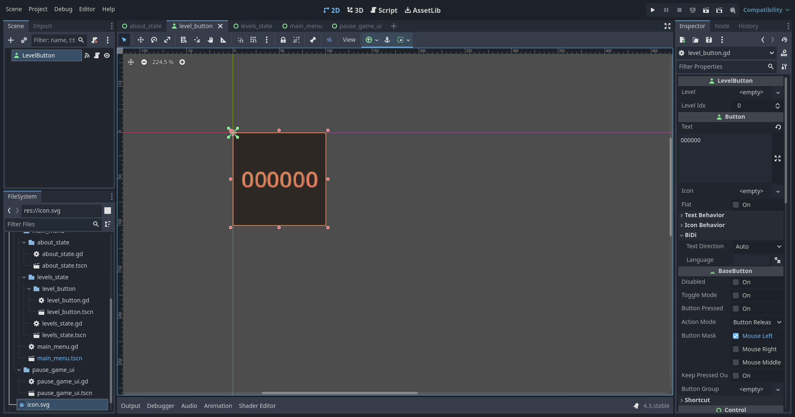

# 2D Платформер

> Часть девятая

## Содержание

- [1. Новое действие](#1-новое-действие)
- [2. Экран `Об Игре`](#2-экран-об-игре)
- [3. Кнопка выбора уровня](#3-кнопка-выбора-уровня)
- [4. Экран `Выбора уровня`](#4-экран-выбора-уровня)
- [5. Экран `Главное Меню`](#5-экран-главное-меню)
- [6. Экран `Паузы`](#6-экран-паузы)
- [7. Дополнение `BaseLevel`](#7-дополнение-baselevel)

## 1. Новое действие

[К Содержанию](#содержание)

Добавьте новое действие `escape` на кнопку `Escape (Esc)` в настройках проекта в разделе `Input Map`.

## 2. Экран `Об Игре`

[К Содержанию](#содержание)

Создадим пустую сцену типа `Control` и назовём её `AboutState`. Давайте сохраним её сразу по такому пути `res://scenes/main_menu/about_state/` и назовём файл `about_state.tscn`.

Создадим дочерние объекты у `AboutState`:

- `Margin` (тип `MarginContainer`; растяните объект на весь размер сцены через панель инструментов; вкладка `Theme Overrides` ➡️ вкладка `Constants` ➡️ `Margin Left / Top / Right / Bottom`: `10`)
  - `VBox` (тип `VBoxContainer`)
    - `StateName` (тип `Label`; `Text`: `Об Игре`, `Horizontal Alignment`: `Center`, вкладка `Theme Overrides` ➡️ вкладка `Font Sizes` ➡️ `Font Size`: `64`)
    - `Content` (тип `VBoxContainer`; вкладка `Layout` ➡️ вкладка `Container Sizing` ➡️ `Vertical`: `Fill` + `Expand`: `true`)
      - `TextureRect` (`Texture`: файл `res://icon.svg`, `Stretch Mode`: `Keep Aspect`)
      - `EngineName` (тип `Label`; сделать имя уникальным (`%`); `Text` (не обязательно): `Godot Engine ...`, `Horizontal Alignment`: `Center`, вкладка `Theme Overrides` ➡️ вкладка `Font Sizes` ➡️ `Font Size`: `32`)
      - `Author` (тип `Label`; `Text`: `Работа студента X группы Y` (изменить под себя), `Horizontal Alignment`: `Center`, `Vertical Alignment`: `Center`, вкладка `Layout` ➡️ вкладка `Container Sizing` ➡️ `Vertical`: `Shrink Center` + `Expand`: `true`, вкладка `Theme Overrides` ➡️ вкладка `Font Sizes` ➡️ `Font Size`: `32`)
    - `Buttons` (тип `VBoxContainer`; вкладка `Layout` ➡️ вкладка `Container Sizing` ➡️ `Horizontal`: `Shrink Center`)
      - `Back` (тип `Button`; `Text`: `Назад`, вкладка `Theme Overrides` ➡️ вкладка `Font Sizes` ➡️ `Font Size`: `32`)

<div style="text-align: center;"></div>
<p align="center">Рисунок 2-1 – Экран `Об Игре`</p>

Создадим скрипт для `AboutState`:

```gdscript
class_name AboutState extends Control

@export var main_menu: MainMenu

@onready var engine_name: Label = %EngineName

func _ready() -> void:
	var engine := Engine.get_version_info()
	engine_name.text = "Godot Engine %s.%s.%s-%s" % [engine.major, engine.minor, engine.patch, engine.status]

# Нужно привязать сигнал "pressed" у кнопки "Back"
func _on_back_pressed() -> void:
	main_menu.set_state(main_menu.States.Main)
```

## 3. Кнопка выбора уровня

[К Содержанию](#содержание)

Создадим пустую сцену типа `Button` и назовём её `LevelButton`. Давайте сохраним её сразу по такому пути `res://scenes/main_menu/levels_state/level_button/` и назовём файл `level_button.tscn`.

Изменяем следующие свойства:

- `Text` (не обязательно): `000000`
- Вкладка `Layout`
  - `Custom Minimum Size`: `(x: 100, y: 100)`
  - `Anchors Preset`: `Top Left`
- Вкладка `Theme Overrides`
  - Вкладка `Font Sizes` ➡️ `Font Size`: `24`
- Вкладка `Visibility`
  - `Modulate`: `ff966c`

<div style="text-align: center;"></div>
<p align="center">Рисунок 3-1 – Кнопка выбора уровня</p>

Создадим скрипт для `LevelButton`:

```gdscript
class_name LevelButton extends Button

@export var level: PackedScene
@export var level_idx: int

func _ready() -> void:
	text = "%s" % [level_idx]

# Нужно привязать сигнал "pressed" у обладателя данного скрипта
func _on_pressed() -> void:
	get_tree().change_scene_to_packed(level)
```

## 4. Экран `Выбора уровня`

[К Содержанию](#содержание)

Создадим пустую сцену типа `Control` и назовём её `LevelsState`. Давайте сохраним её сразу по такому пути `res://scenes/main_menu/levels_state/` и назовём файл `levels_state.tscn`.

Создадим дочерние объекты у `LevelsState`:

- `Margin` (тип `MarginContainer`; растяните объект на весь размер сцены через панель инструментов; вкладка `Theme Overrides` ➡️ вкладка `Constants` ➡️ `Margin Left / Top / Right / Bottom`: `10`)
  - `VBox` (тип `VBoxContainer`)
    - `NameState` (тип `Label`; `Text`: `Уровни`, `Horizontal Alignment`: `Center`, вкладка `Theme Overrides` ➡️ вкладка `Font Sizes` ➡️ `Font Size`: `64`)
    - `Levels` (тип `HBoxContainer`; сделать имя уникальным (`%`))
    - `Space` (тип `Control`; вкладка `Layout` ➡️ вкладка `Container Sizing` ➡️ `Vertical`: `Fill` + `Expand`: `true`)
    - `Buttons` (тип `VBoxContainer`; вкладка `Layout` ➡️ вкладка `Container Sizing` ➡️ `Horizontal`: `Shrink Center`)
      - `Back` (тип `Button`; `Text`: `Назад`, вкладка `Theme Overrides` ➡️ вкладка `Font Sizes` ➡️ `Font Size`: `32`)

<div style="text-align: center;"></div>
<p align="center">Рисунок 4-1 – Экран `Выбора уровня`</p>

Создадим скрипт для `LevelsState`:

```gdscript
class_name LevelsState extends Control

const MIN_LEVEL_IDX := 1
const LEVEL_BUTTON := preload("res://scenes/main_menu/levels_state/level_button/level_button.tscn")

@export var main_menu: MainMenu

var levels_path := "res://scenes/levels/"
var found_levels := []
var found_level_template := {
	"idx": 0,
	"path": "",
}

@onready var levels: HBoxContainer = %Levels

func _ready() -> void:
	find_levels()

# Поиск уровней в игре
# Важно соблюдать правила наименований папок с уровнями
func find_levels() -> void:
	var current_idx := MIN_LEVEL_IDX
	var current_level_folder := levels_path + "%s/" % [current_idx]
	while DirAccess.dir_exists_absolute(current_level_folder):
		var current_level := current_level_folder + "level.tscn"
		if ResourceLoader.exists(current_level):
			var new_level := found_level_template.duplicate()
			new_level.idx = current_idx
			new_level.path = current_level
			found_levels.append(new_level)
			
			current_idx += 1
			current_level_folder = levels_path + "%s/" % [current_idx]
	load_levels()

func load_levels() -> void:
	for current_level: Dictionary in found_levels:
		var level_button := LEVEL_BUTTON.instantiate()
		level_button.level_idx = current_level.idx
		level_button.level = load(current_level.path)
		levels.add_child(level_button)

# Нужно привязать сигнал "pressed" у кнопки "Back"
func _on_back_pressed() -> void:
	main_menu.set_state(main_menu.States.Main)
```

## 5. Экран `Главное Меню`

[К Содержанию](#содержание)

Создадим пустую сцену типа `Control` и назовём её `MainMenu`. Давайте сохраним её сразу по такому пути `res://scenes/main_menu/` и назовём файл `main_menu.tscn`.

Создадим дочерние объекты у `MainMenu`:


- `BackDark` (тип `ColorRect`; сделать имя уникальным (`%`); растяните объект на весь размер сцены через панель инструментов; `Color`: `00000080`, вкладка `Visibility` ➡️ `Visible`: `false`)
- `Margin` (тип `MarginContainer`; растяните объект на весь размер сцены через панель инструментов; вкладка `Theme Overrides` ➡️ вкладка `Constants` ➡️ `Margin Left / Top / Right / Bottom`: `10`)
  - `MainState` (тип `VBoxContainer`; сделать имя уникальным (`%`))
    - > Иерархия дочерних узлов объекта `MainState` будет показана отдельно ниже.
  - `LevelsState` (добавьте сцену через иконку цепочки; сделать имя уникальным (`%`); `Main Menu`: укажите родительский узел (`MainMenu`), вкладка `Visibility` ➡️ `Visible`: `false`)
  - `AboutState` (добавьте сцену через иконку цепочки; сделать имя уникальным (`%`); `Main Menu`: укажите родительский узел (`MainMenu`), вкладка `Visibility` ➡️ `Visible`: `false`)
- `FrontDark` (тип `ColorRect`; сделать имя уникальным (`%`); растяните объект на весь размер сцены через панель инструментов; `Color`: `00000080`, вкладка `Visibility` ➡️ `Visible`: `false`)
- `QuitDialog` (тип `ConfirmationDialog`; сделать имя уникальным (`%`); `Cancel Button Text`: `Нет`, `OK Button Text`: `Да`, `Text`: `Выйти из игры?`, `Title`: `Вопрос`, `Initial Position`: `Center of Main Window Screen`, вкладка `Flags` ➡️ `Unresizable`: `true`, вкладка `Visibility` ➡️ `Visible`: `false`)

Иерархия дочерних узлов объекта `MainState`:

- `GameName` (тип `Label`; сделать имя уникальным (`%`); `Text`: `Название Игры`, `Horizontal Alignment`: `Center`, вкладка `Theme Overrides` ➡️ вкладка `Font Sizes` ➡️ `Font Size`: `64`)
- `Space` (тип `Control`; вкладка `Layout` ➡️ вкладка `Container Sizing` ➡️ `Vertical`: `Fill` + `Expand`: `true`)
- `Buttons` (тип `VBoxContainer`; вкладка `Layout` ➡️ вкладка `Container Sizing` ➡️ `Horizontal`: `Shrink Center`, вкладка `Theme Overrides` ➡️ вкладка `Constants` ➡️ `Separation`: `10`)
  - `SelectLevel` (тип `Button`; сделать имя уникальным (`%`); `Text`: `Уровни`, вкладка `Theme Overrides` ➡️ вкладка `Font Sizes` ➡️ `Font Size`: `32`)
  - `About` (тип `Button`; сделать имя уникальным (`%`); `Text`: `Об Игре`, вкладка `Theme Overrides` ➡️ вкладка `Font Sizes` ➡️ `Font Size`: `32`)
  - `Quit` (тип `Button`; сделать имя уникальным (`%`); `Text`: `Выход`, вкладка `Theme Overrides` ➡️ вкладка `Font Sizes` ➡️ `Font Size`: `32`)

<div style="text-align: center;"></div>
<p align="center">Рисунок 5-1 – Экран `Главное Меню`</p>

Создадим скрипт для `MainMenu`:

```gdscript
class_name MainMenu extends Control

enum States { Main, Levels, About, Quit }
var current_state: States = States.Main

@onready var main_state: VBoxContainer = %MainState
@onready var levels_state: LevelsState = %LevelsState
@onready var about_state: AboutState = %AboutState

@onready var back_dark: ColorRect = %BackDark
@onready var front_dark: ColorRect = %FrontDark
@onready var quit_dialog: ConfirmationDialog = %QuitDialog

func _ready() -> void:
	Input.mouse_mode = Input.MOUSE_MODE_VISIBLE
	set_state(States.Main)

func check_state() -> void:
	match current_state:
		States.Main:
			back_dark.hide()
			main_state.show() # Показываем главный экран меню
			levels_state.hide()
			about_state.hide()
			front_dark.hide()
			quit_dialog.hide()
		States.Levels:
			back_dark.show() # Затемняем пространство за экранами
			main_state.hide()
			levels_state.show() # Показываем экран выбора уровня
			about_state.hide()
			front_dark.hide()
			quit_dialog.hide()
		States.About:
			back_dark.show() # Затемняем пространство за экранами
			main_state.hide()
			levels_state.hide()
			about_state.show() # Показываем экран об игре
			front_dark.hide()
			quit_dialog.hide()
		States.Quit:
			back_dark.hide()
			main_state.show() # Показываем главный экран меню
			levels_state.hide()
			about_state.hide()
			front_dark.show() # Затемняем пространство после экранов
			quit_dialog.show() # Показываем диалог выхода из игры

func set_state(value: States) -> void:
	current_state = value
	check_state()

# Нужно привязать сигнал "pressed" у кнопки "SelectLevel"
func _on_select_level_pressed() -> void:
	set_state(States.Levels)

# Нужно привязать сигнал "pressed" у кнопки "About"
func _on_about_pressed() -> void:
	set_state(States.About)

# Нужно привязать сигнал "pressed" у кнопки "Quit"
func _on_quit_pressed() -> void:
	set_state(States.Quit)

# Нужно привязать сигнал "confirmed" у объекта "QuitDialog"
func _on_quit_dialog_confirmed() -> void:
	get_tree().quit()

# Нужно привязать сигнал "canceled" у объекта "QuitDialog"
func _on_quit_dialog_canceled() -> void:
	set_state(States.Main)
```

> Измените главную сцену в настройках проекта (раздел `General` ➡️ вкладка `Application` ➡️ вкладка `Run` ➡️ свойство `Main Scene`) на сцену главного меню (`res://scenes/main_menu/main_menu.tscn`)

## 6. Экран `Паузы`

[К Содержанию](#содержание)

Создадим пустую сцену типа `Control` и назовём её `PauseGameUI`. Давайте сохраним её сразу по такому пути `res://scenes/pause_game_ui/` и назовём файл `pause_game_ui.tscn`.

Создадим дочерние объекты у `PauseGameUI`:

- `BG` (тип `ColorRect`; растяните объект на весь размер сцены через панель инструментов; `Color`: `00000080`)
- `PauseUI` (тип `MarginContainer`; растяните объект на весь размер сцены через панель инструментов; сделать имя уникальным (`%`); вкладка `Theme Overrides` ➡️ вкладка `Constants` ➡️ `Margin Left / Top / Right / Bottom`: `10`)
- `VBox` (тип `VBoxContainer`)
  - `UIName` (тип `Label`; `Text`: `Пауза`, `Horizontal Alignment`: `Center`, вкладка `Theme Overrides` ➡️ вкладка `Font Sizes` ➡️ `Font Size`: `64`)
  - `Space` (тип `Control`; вкладка `Layout` ➡️ вкладка `Container Sizing` ➡️ `Vertical`: `Fill` + `Expand`: `true`)
  - `Buttons` (тип `VBoxContainer`; вкладка `Layout` ➡️ вкладка `Container Sizing` ➡️ `Horizontal`: `Shrink Center`, вкладка `Theme Overrides` ➡️ вкладка `Constants` ➡️ `Separation`: `10`)
    - `Continue` (тип `Button`; `Text`: `Продолжить`, вкладка `Theme Overrides` ➡️ вкладка `Font Sizes` ➡️ `Font Size`: `32`)
    - `Restart` (тип `Button`; `Text`: `Перезагрузить`, вкладка `Theme Overrides` ➡️ вкладка `Font Sizes` ➡️ `Font Size`: `32`)
    - `InMainMenu` (тип `Button`; `Text`: `В Главное Меню`, вкладка `Theme Overrides` ➡️ вкладка `Font Sizes` ➡️ `Font Size`: `32`)

<div style="text-align: center;"></div>
<p align="center">Рисунок 6-1 – Экран `Паузы`</p>

Создадим скрипт для `PauseGameUI`:

```gdscript
class_name PauseGameUI extends Control

const MAIN_MENU_SCENE_PATH := "res://scenes/main_menu/main_menu.tscn"

enum States { Game, Pause, Restart, InMainMenu }
var current_state := States.Game

@onready var pause_ui: MarginContainer = %PauseUI

func _ready() -> void:
	hide()
	pause_ui.show()

func check_state() -> void:
	match current_state:
		# Игрок играет
		States.Game:
			Input.mouse_mode = Input.MOUSE_MODE_CAPTURED
			get_tree().paused = false
			hide()
			pause_ui.show()
		# Игрок приостанавливает игру
		States.Pause:
			Input.mouse_mode = Input.MOUSE_MODE_VISIBLE
			get_tree().paused = true
			show()
			pause_ui.show()
		# Игрок перезапускает уровень
		States.Restart:
			Input.mouse_mode = Input.MOUSE_MODE_CAPTURED
			get_tree().paused = false
			get_tree().reload_current_scene()
		# Игрок выходит из игры в главное меню
		States.InMainMenu:
			Input.mouse_mode = Input.MOUSE_MODE_VISIBLE
			get_tree().paused = false
			get_tree().change_scene_to_file(MAIN_MENU_SCENE_PATH)

func set_state(value: States) -> void:
	current_state = value
	check_state()

func _input(_event: InputEvent) -> void:
	if Input.is_action_just_pressed("escape"):
		match current_state:
			States.Game:
				set_state(States.Pause)
			States.Pause:
				set_state(States.Game)

# Нужно привязать сигнал "pressed" у кнопки "Continue"
func _on_continue_pressed() -> void:
	set_state(States.Game)

# Нужно привязать сигнал "pressed" у кнопки "Restart"
func _on_restart_pressed() -> void:
	set_state(States.Restart)

# Нужно привязать сигнал "pressed" у кнопки "InMainMenu"
func _on_in_main_menu_pressed() -> void:
	set_state(States.InMainMenu)
```

## 7. Дополнение `BaseLevel`

[К Содержанию](#содержание)

Зайдите на сцену `BaseLevel` и добавьте экран паузы в качестве дочернего узла к `FGLayer`.

<div style="text-align: center;"></div>
<p align="center">Рисунок 7-1 – Дополнение `BaseLevel`</p>
